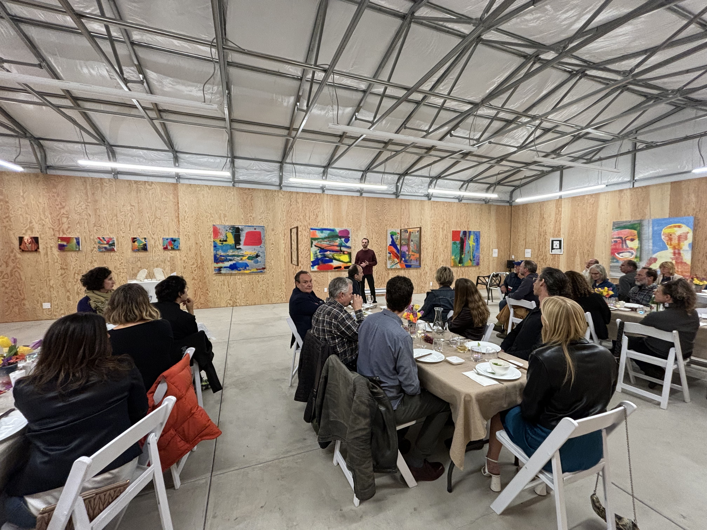

We just wrapped an extraordinary two weeks here in Berkeley exhibiting art that makes use of AI in novel ways. I was the co-founder and co-curator the show, called [CuratingAI](https://www.curatingAI.art). While our common experience with (generative) AI is digital—rendered and consumed on screens—CuratingAI was designed to highlight physical works (ie., sculptures, painting, and drawing) that use AI as a key element in the creative process. This juxtaposition of the intangible AI with the tangible opened the opportunity for viewers to reflect on timely debates about training data, bias, ownership, and the transference of creativity between digital and physical realms. The basic question we posed to ourselves when we set out to build the show was (and still is):
<blockquote>
When artists work with AI's new generative tools, are they creators, curators or collaborators? 
</blockquote>

When and where technology change coincided—or even drove societal change (ie. the printing press and photography) art has been there to help us come to terms with those changes, embracing and incorporating new technologies into the art practice.  I believe we are at a similar moment with AI.  The artists in [CuratingAI](https://www.curatingai.art) are early adopters—the few in the world—who are embracing AI and, rather than fearing its potential for disruption, they’re working in conversation with it, exploring its depths, its limitations, its hallucinations, and the hidden beauty of its inner workings.

## The Show

<figure>
    
    <figcaption>Brett Amory. "Making is Konitong" 2023. Medium: ink on wood. Dimensions: 16 x 20 inches </figcaption>
</figure>

After ~two years of discussion about a potential show with co-founder Steve Lomprey and Claudia Bloom (my daughter!), last fall the program started to take real shape when we met Jonathan Bachrach who agreed that his relatively new Berkeley art space [120710](120710.art) could host the exhibit. And, after months of planning, we finally exhibited with fabulously talented artists:

  - [Brett Amory] (https://brettamory.com/)
  - [Carl Bass] (https://www.carlbass.com/)
  - [Claudia Bloom] (https://claudiabloom.art/)
  - [Luke Dzwonczyk] (https://www.youtube.com/channel/UCImQuvrqfjLIErdCmZdjGuw) / [Etienne Chambaud] (https://www.etiennechambaud.com/)
  - [Elle O Hill] (https://www.linkedin.com/in/elle-o-hill-624245265/)
  - [Ahna Girshick] (https://www.lightdark.org/)
  - [Steve Lomprey] (https://www.stevelomprey.com/)
  - [Greg O. Niemeyer] (https://www.gregniemeyer.com/)
  - [Joel Simon] (https://joelsimon.net/)

<figure>
    
    <figcaption>Ahna Girshick: "Convolutions (112 synthetic neurons from Inception v1, inception layer 3a)" (2024) Medium: Archival pigment print on dibond panel, custom software. Dimensions: 42.5” x 71.75” x 2 1/8” (framed)</figcaption>
</figure>

We had three main events around the show: an opening preview dinner (fundraiser for the 120710 gallery), opening night, and closing (with panel discussion, see below). All three well-exceeded our expectations in terms of attendance and enthusiasm.

<figure>
     
    <figcaption>Artists discussing their work at the preview dinner dinner </figcaption>
</figure>

The [complete catalog of works](https://web-production-7d4c4.up.railway.app/pieces/pieces/pieces/shows/7/) includes those pieces still for sale and those not for sale.

<figure>
     
    <figcaption>Opening night of CuratingAI</figcaption>
</figure>

I kicked off the preview dinner noting that ``<i>the co-curators wanted to bring AI back the physical realm back, and I say back purposely here because that is where AI is born. Let me explain: it’s of course natural to think of AI as a model of zeros and ones, a digital function that takes inputs and gives outputs, but what we forget in this digital age is that those images and texts used to train models were in their original form pictures of captured natural scenes or words coming out of a pure carbon based intelligence—only later was the analog digitized.  And now today we bring it back into the physical realm.  We’ll have the rest of our lives to consume ai generated content on digital screens—not here tonight...
''</I>

## Closing Panel Discussion

On April 27th, it was my absolute pleasure to moderate a panel with Cal Professor Ken Goldberg, former Autodesk CEO Carl Bass (and artist), and artist/researcher Ahna Gishick. It was a wide-ranging, nuanced discussion examining the opportunities, challenges, and ethical implications as AI capabilities intersect with human artistic creativity.

<iframe width="560" height="315" src="https://www.youtube.com/embed/H4bsIDvm1M4?si=lOTao05htWety4Jn" title="YouTube video player" frameborder="0" allow="accelerometer; autoplay; clipboard-write; encrypted-media; gyroscope; picture-in-picture; web-share" referrerpolicy="strict-origin-when-cross-origin" allowfullscreen></iframe>

The panelists shared their personal introductions to AI and how they are incorporating AI tools into their creative work. We then  discussed whether AI will displace human creativity and artistic labor. The panelists were generally optimistic that AI will augment and enhance human creativity rather than replace it. Ethical considerations around AI art were raised, such as appropriating copyrighted data for training models, potential biases in training data, and the ability to generate art mimicking human styles at scale. We also discussed the role of the human artist was emphasized in curation, editing, and imbuing conceptual depth that AI may lack.
Questions were raised about whether AI-generated art in the future will be distinguishable from human art, with perspectives varying on the inevitability of that occurrence.

We touched on the democratization of AI-guided tools for creative work. As Fernando Pérez noted, the key ingredient to making this possible is natural language, where text becomes the "universal interface" written form, image and video generation, and more. While new tools, standalone like MidJourney or ChatGPT or embedded like in Photoshop, it seemed clear to the panel that such outputs (while certainly of value) would not and perhaps should not be considered "fine art." 

<figure>
    
    <figcaption>Gallery view of CuratingAI</figcaption>
</figure>

## What's Next?

I'm proud of what we were able to accomplish in this show, particularly in bringing together such a wide range and consistently high quality of the work. Perhaps most gratifying is that CuratingAI showcased the work of those in a variety of stages in their careers and life, from Berkeley high school, to Cal undergraduate, to Cal graduate students, to established artists.

We did not offer a value judgement on the role of AI in society. CuratingAI was a show celebrating the creative expression with a powerful technology in a fast changing world.  This world will continue to evolve and while we do not have plans for another show in the short term, I suspect we and others will be interested in another curating show soon.