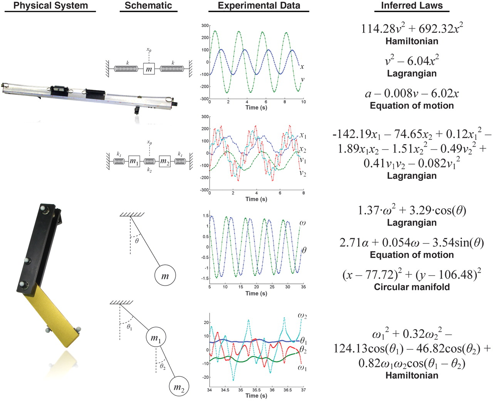
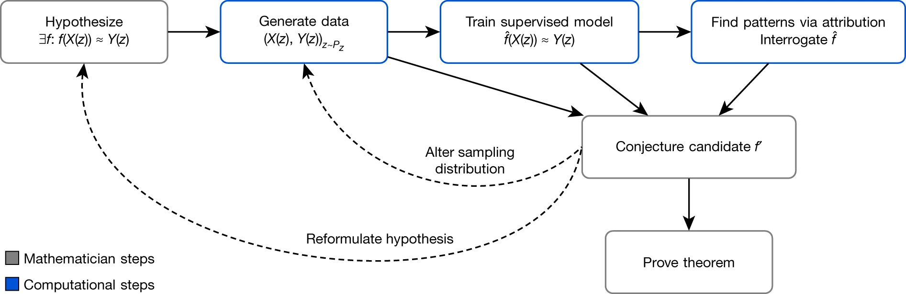

Something very exciting is happening right now across the landscape of the physical and mathematical sciences: we are finally starting to learn **fundamentally** new things about how the universe works because of the direct and purposeful use of artificial intelligence/machine learning (AI/ML). Last week, two major results (discussed below) suggests that the long-sought, oft-discussed hope of an AI-driven revolution in science may now be coming to fruition.

To be sure, AI/ML has been an integral part of our scientific workflows for years. We might categorize the to-date uses and utility of AI/ML thus far as: 

1. **Discovery Enhancing** 
In astronomy, we've used [ML-based classification engines to accelerate discovery of new transient events in imaging surveys](https://ui.adsabs.harvard.edu/abs/2012PASP..124.1175B/abstract), finding celestial gems better, faster, and on a larger scale than we could have ever hoped to do human experts looking at data or hand-crafted decision rules (I'm particular proud that a decade ago our ML classifier, working on real data in real time, identified the [nearest Type Ia supernova in 3 decades](https://newscenter.lbl.gov/2011/08/25/supernova/)). and for [generative event simulation](https://ui.adsabs.harvard.edu/abs/2018PhRvD..97a4021P/abstract).  While hundreds of papers have been written about astronomical events discovered with ML assistance, the *tools deployed in real data analysis chains are generally supervised, answering (probabilistically) yes-no or multi-class classification questions*. Doing this well means alerting scientists to important places in the sky, using precious followup resources more efficiently, and accelerating the time from data taking to scientifically relevant outcomes. We may find more of the sort of objects and events we already knew about or perhaps new objects and events we had not. In high-energy particle physics, ML has been used for event discrimination leading to better/faster measurements of fundamental particle interactions.
2. **Accelerating Simulation and Prediction**
Some of the most challenging scientific problems of our time require very expensive calculations such as predicting interactions from folded proteins, understanding how the universe evolves with different cosmological parameters, and understanding how the strong force influences the behaviors of particles and structures. All of these fields have seen giant leaps: ML has been used to [predict how proteins fold](https://www.nature.com/articles/d41586-020-03348-4),  to [accelerate cosmological simulations](https://www.cmu.edu/news/stories/archives/2021/may/machine-learning-cosmology.html), and to [speed up lattice quantum chromodynamics (QCD) calculations](https://journals.aps.org/prd/abstract/10.1103/PhysRevD.97.094506). ML-accelerated simulation also helps to [predict the basic properties of materials/crystalline structures](https://www.nature.com/articles/s41467-020-19964-7). In math, AI/ML has been used to find counterexamples to known conjectures.
3. **Enabling "Inverse Problem" Inference** 
A key component of scientific inquiry is understanding how data fits (or does not) within a given model framework. We often talk about parameter fitting — asking what set of inputs to a model are best described by the data we have observed. For simple models, doing this sort of inference is straightforward. By standard optimization methods, we can iteratively perform "forward" computations and ask quantitatively how well the model predictions match the data observed. However, for complex and long-running forward models (which might also need to include the effects of the observational effects on the pure signal) doing the inverse problem becomes rather computationally expensive if not intractable. So-called likelihood-free (LFI) or simulation-based inference (SBI) techniques have started to emerge as a tool for doing inverse-problem parameter inference in science. [Cranmer et al. (2020)](https://www.pnas.org/content/117/48/30055) identified a number of applications in physics and astronomy.

All of the above uses for AI/ML, I'd argue, work within the confines of already established and understood models. With better simulations we can make better predictions about the physical/biological world. With better classifiers we can discover new objects in our data, find needles in a haystack at scale. With faster inference we can constrain our models with observation and perhaps identify places where our models are deficient or at least insufficient in describing real world phenomena. (There's a dizzying array of new work in all these realms, most obviously evidenced in the contributions in the upcoming ***[Machine Learning and the Physical Sciences Workshop](https://neurips.cc/Conferences/2021/Schedule?showEvent=21862)*** at [NeurIPS 2021](https://neurips.cc/Conferences/2021/).) While powerful new tools in our science toolbox, and the application of these techniques has surely propelled science, I'd suggest these have yet to lead us to fundamentally new discoveries. 

## New Milestones in Fundamental Discovery

A scientific revolution, in a [Kuhnian sense](https://www.nature.com/articles/484164a), would allow us to see the world in a fundamentally new light. For physicists that would be less about finding a new particle that is predicted by the standard model and more about identifying new physical models or laws. The promise of learning new physical laws from data has been evident and shown plausible for years. Schmidt & Lipson showed in 2009 how symbolic regression could recover the laws governing the motion of a few simple systems. In 2019, [Udrescu and Tegmark "rediscovered" fundamental physics equations](https://arxiv.org/abs/1905.11481) by observing mock noisy data and applying symbolic regression driven by machine learning. One of the grand hopes in physics is to discover new general laws or principles by showing experimental data to a machine. The machine, in turn, could propose an interpretable understanding of the phenomena which would presumably be applicable to other similar physical situations. (Note there's a reasonable question whether such discoveries absolutely must be interpretable for them to be considered fundamental: so long as they make accurate predictions that generalize might that be the only required criterion?  This was the line of argument in Chris Anderson's provocative [2009 "**The End of Theory: The Data Deluge Makes the Scientific Method Obsolete](https://www.wired.com/2008/06/pb-theory/)."** I, however, still fancy the old school view of science that demands parsimony, and by extension interpretability, in physical models).

<figure>

<figcaption><small>
Figure 1: Observations of real physical systems led to the (re) discovery of the correct known physical laws describing the motion (from <a link="https://www.science.org/doi/10.1126/science.1165893">Schmidt & Lipson 2009</a>).</small>
</figcaption>
</figure>

Instead of observations leading to new physics, which has yet to lead to a true breakthrough, the other exciting path is to study facets of physical laws and equations themselves, hoping to make connections that lead to fundamental insight. This appears to have just happened in two realms: in mathematics and astrophysics.

### AI-Assisted Mathematical Discovery

Last week, a group from academia and industry (DeepMind) [published](https://www.nature.com/articles/s41586-021-04086-x) "**Advancing mathematics by guiding human intuition with AI,"** a paper that proposed ****an ML-based process that helped guide human intuition and propose new mathematical theorems and conjectures. The process generated non-trivial conjectures about the [connection between algebraic and geometric invariants of knots which allowed mathematicians to "complete the conjecture and also prove the theorem.](https://www.newscientist.com/article/2299564-deepmind-ai-collaborates-with-humans-on-two-mathematical-breakthroughs/) By fostering "fundamental new discoveries, one in topology and another in representation theory," the researchers claim to have produced a general approach to augment and improve work of mathematicians.

<figure>
 
<figcaption>
<small> Workflow for generating conjectures and proving mathematical theorems (from <a href="https://www.nature.com/articles/s41586-021-04086-x">Davies et al. 2021</a>).
</small>
</figure>

### AI-Assisted Astrophysical Discovery

Interestingly, earlier in the week, we posted a paper that makes a similar AI-assisted discovery in astrophysics: "**[A Ubiquitous Unifying Degeneracy in 2-body Microlensing Systems](https://arxiv.org/abs/2111.13696)."  (**The paper is under review at the time of writing this post) Unlike in the previous AI/ML work in astronomy our work showed how an ML inference process previously developed led us to discover something new and fundamental about the equations that govern the general relativistic effect of light bending by two massive bodies. The [gravitational lens equation](https://en.wikipedia.org/wiki/Gravitational_lensing_formalism#Thin_lens_approximation) has been studied in the context of star-planet lensing of background stars for many decades. Such previous work led to an understanding of the existence of several types of "degeneracies," where the same observations lead to the inference of more than one lens configuration. However, our AI-assisted work studying simulated events using likelihood-free inference revealed a new type of degeneracy. Upon further investigation, my student Keming Zhang and collaborator B. Scott Gaudi realized that the [previous degeneracies appear to be edge cases of this new degeneracy](https://twitter.com/bsgaudi/status/1466452287770005509). Furthermore, we found that the new degeneracy [better explains some of the subtle yet pervasive inconsistencies seen real events from the past](https://twitter.com/bsgaudi/status/1466452337241772035). This discovery was hiding in plain sight. We suggest that our method can be used to study other degeneracies in systems where inverse-problem inference is intractable computationally.

To be really clear, neither of these new results are particularly revolutionary in the sense that they demand we look at the world in truly fundamental new light (at the level of Einsteinian gravity or the dissolution of phlogiston theory) I but argue that they constitute the first time ML has been used to directly yield new theoretical insight in math and astronomy. We can and should (I'm obviously biased!) construe this moment as an important milestone: the arrival and demonstrated efficacy of new AI/ML toolkits for fundamental insight. It's still very early innings for AI & Science and I couldn't be more excited about the future.