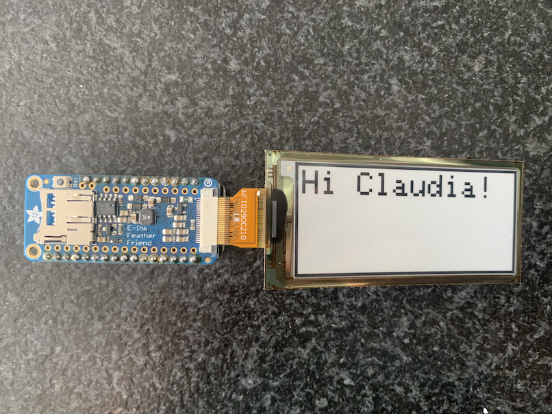

We wear masks out in public so often it occurred to me we should be able to dynamically customize them to suit our moods and maybe even sell advertising space! Masks also hide a good part of our facial expressions and so I wondered if I couldn't create a portion of a mask that lets people know how we're doing underneath. So I prototyped a wearable mask with a flexible e-ink display that can dynamically show content.

<!--more-->

<h2>Getting the Parts</h2>

[Adafruit](https://www.adafruit.com) is my go-to place for electronics prototyping, especially when it comes to [arduino](https://www.arduino.cc/) tinkering. After some research, it looked like the Feather + E-ink Featherwing would be the right base for this project. I especially wanted something lightweight that could work on the go (ie. have a battery powered option and talk to my phone). Since I knew I wanted to wrap the display on my mask, the display needed to be flexible and big enough to read from at least 6 feet away.

<video width="320" height="240" controls loop autoplay>
  <source src="https://cdn-shop.adafruit.com/product-videos/1024x768/4262-06.mp4" type="video/mp4">
</video>

Here's the parts list I settled on:

 - 1 x [2.9" Flexible Monochrome eInk / ePaper Display (296x128 Monochrome)](https://www.adafruit.com/product/4262
)
[ID:4262] = $26.95
 - 1 x 24-pin eInk / ePaper Extension Cable 0.5mm Pitch - 25cm Long [ID:4230] =
$1.35
 - 1 x Adafruit eInk Feather Friend with 32KB SRAM[ID:4446] = $8.95
 - 1 x Header Kit for Feather - 12-pin and 16-pin Female Header Set [ID:2886] =
$0.95
 - 1 x Lithium Ion Polymer Battery - 3.7v 150mAh [ID:1317] = $5.95
 - 1 x Short Headers Kit for Feather - 12-pin + 16-pin Female Headers [ID:2940]
= $1.50
 - 1 x Adafruit Feather M0 Bluefruit LE [ID:2995] = $29.95
 - 1 x 24-pin FFC / FPC Extender [ID:4524] = $0.86

<h2>Electronics Assembly and Setup</h2>

Soldiering the header kit to the feather and featherwing was straightforward, after I dug up an old breadboard to keep the pins in place. The li ion battery attaches to the feather and is charged (slowly) when the microusb power supply/data cable is connected. A very nice feature of the feather design is the ability to jump over to battery power once the microusb is disconnected.

The next step was to download the [latest Arduino IDE](https://www.arduino.cc/en/main/software) and install the [Bluetooth](https://learn.adafruit.com/adafruit-feather-32u4-bluefruit-le) and [Eink libraries](https://github.com/adafruit/Adafruit_EPD). The board can be interacted with via bluetooth and a mobile app called [BlueFruit Connect](https://apps.apple.com/us/app/adafruit-bluefruit-le-connect/id830125974).

Combining demo scripts for the Bluetooth interaction and E-ink display, I hacked together a little Arduino code which allows the user to type in messages to the their phone and have it show up on the display.

To protect the display, I made sure that the e-ink display cannot be changed more than once per 10 seconds.

<h2>Sewing it in</h2>

I found a cloth mask with a few cotton layers that I could use to cut out a window the display, with the connector pins sticking out of the side. Placing the display inside the window, I then sewed (crudely) around the display being careful not to pierce it.

<h2>The Result</h2>

The prototype turned out pretty much as I had hoped (apologizes for the unkempt hair).

You can see a little demo here:

<video  width="100%" controls>
    <source src="https://drive.google.com/uc?export=download&id=1jbOwQiQzcUzJCiRZGSOM-D3WZ4klME7s" type='video/mp4'>
</video>

<h2>Next Steps</h2>

I initially forgot to order the PIN extender for the ribbon cable, which means I currently have to place the electronics directly next to the mask, instead of around the back of the head (say under a hat). Also, I didn't yet manage to get images working (since that required an SD card). Perhaps the destiny is that we can sell our GPS location (and beacon IDs of people nearby) to companies and have them dynamically upload advertisements as we go about our business. Yeah, maybe that's too dystopic an idea even for 2020!
