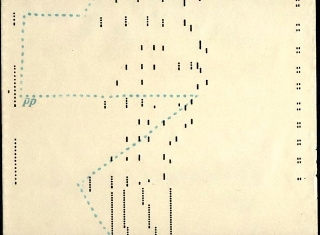

<strong>Preamble</strong>: A natural progression beyond artificial intelligence is artificial creativity. I've been interested in AC for awhile and started learning of the various criteria that the <a href="hhttp://www.computationalcreativity.net/iccc2013/accepted-papers/">scholarly community</a> has devised to test AC in art, music, writing, etc. (I think <a href="https://medium.com/p/d336475d3992"><em>crosswords</em> might present an interesting Turing-like test for AC</a>). In music, a machine-generated score which is deemed interesting, challenging, and unique (and indistinguishable from the real work of a great master), would be a major accomplishment. Machine-generated music has a long history (cf. <em>"<a href="https://mitpress.mit.edu/books/computer-models-musical-creativity">Computer Models of Musical Creativity</a>"</em> by D. Cope; Cambridge, MA: MIT Press, 2006).

<iframe src="https://w.soundcloud.com/player/?url=https%3A//api.soundcloud.com/tracks/211116440" scrolling="no" width="100%" height="166" frameborder="no"></iframe>

<strong>Deep Learning at the character level</strong>: With the resurgence of interest in&nbsp;<a target="_blank" href="https://en.wikipedia.org/wiki/Recurrent_neural_network">Recurrent Neural Networks</a> (RNNs) with <a target="_blank" href="http://deeplearning.cs.cmu.edu/pdfs/Hochreiter97_lstm.pdf">Long Short-Term Memory (LSTM)</a>, I thought it would be interesting to see how far we could go in autogenerating music. RNNs have actually been around in <a href="http://people.idsia.ch/~juergen/blues/">music generation for awhile</a> (even with LSTM; see <a href="http://www.brandmaier.de/alice/">this site</a> and <a href="http://arxiv.org/abs/1412.3191">this 2014 paper from Liu &amp; Ramakrishnan and references therein</a>), but we're now getting into an era where we can train on a big corpus and thus train a big, complex model. Andrej Karpathy's recent <a href="http://karpathy.github.io/2015/05/21/rnn-effectiveness/">blog showed how training a character-level model</a> on Shakespeare and Paul Graham essays could yield interesting, albeit fairly garbled, text that seems to mimic the flow and usage of <a href="http://arxiv.org/abs/1412.3191"><!--more--></a>English in those contexts. Perhaps more interesting was his ability to get nearly perfectly compilable LaTeX, HTML, and C. A strong conclusion is that character-level RNNs + LSTMs get pretty good at learning structure even if the sense of the expression seems like nonsense. This an important conclusion related to mine (if you keep reading).

Fig 1: Image of a Piano Roll (via&nbsp;<a href="http://www.elektra60.com/news/dreams-vinyl-story-lp-long-playing-record-jac-holzman">http://www.elektra60.com/news/dreams-vinyl-story-lp-long-playing-record-jac-holzman</a>). Can a machine generate a score of intererst?

<h3 id="Data-Prep-for-training">Data Prep for training<a class="anchor-link" href="#Data-Prep-for-training"> </a></h3>

While we're using advanced Natural Language Processing (NLP) in my company, <a target="_blank" href="http://wise.io/">wise.io</a>, using RNNs is still very early days for us (hence the experimentation here). Also, I should say that I am nowhere near an expert in deep learning and so, for me, a critical contribution from Andrej Karpathy is the availability of code that I could actually get to run and understand. Likewise, I am nowhere near an expert on music theory nor practice. I dabbled in piano about 30 years ago and can read music, but that's about it. So I'm starting this project on a few shaky legs to be sure.

<strong>Which music?</strong> To get train a model using <a href="https://github.com/karpathy/char-rnn">Karpathy's codebase on GitHub</a>, I had to create a suitable corpus. Sticking a single musical genre and composer makes sense. Using the fewest number of instruments seemed sensible too. So I chose piano sonatas for two hands from Mozart and Beethoven.

<strong>Which format?</strong> &nbsp;As I learned, there are over a dozen different digital formats used in music, some of them more&nbsp;versatile than others, some of them focused on enabling complex visual score representation. It became pretty clear that one of the preferred modern markup of sophisticated music manipulation codebases (like <a href="http://mit.edu/music21/"><code>music21</code></a> from MIT) is the XML-based MusicXML (ref). The other is humdrum **kern. Both are readily convertible to each other, although humdrum appears to be more compact (and less oriented towards the visual representation of scores).

Let's see the differences between the two formats. There's a huge corpus of classical music at <a href="http://kern.humdrum.org/">http://kern.humdrum.org</a> (<em>"7,866,496 notes in 108,703 files"</em>).

Let's get Mozart's Piano Sonata No. 7 in C major (<code>sonata07-1.krn</code>)&nbsp; &nbsp;

<pre>!curl -o sonata07-1.krn "http://kern.humdrum.org/cgi-bin/ksdata?l=users/craig/classical/mozart/piano/sonata&amp;file=sonata07-1.krn"</pre>

<pre> &nbsp;% Total &nbsp; &nbsp;% Received % Xferd &nbsp;Average Speed &nbsp; Time &nbsp; &nbsp;Time &nbsp; &nbsp; Time &nbsp;Current
&nbsp; &nbsp; &nbsp; &nbsp; &nbsp; &nbsp; &nbsp; &nbsp; &nbsp; &nbsp; &nbsp; &nbsp; &nbsp; &nbsp; &nbsp; &nbsp; &nbsp;Dload &nbsp;Upload &nbsp; Total &nbsp; Spent &nbsp; &nbsp;Left &nbsp;Speed
100 22098 &nbsp; &nbsp;0 22098 &nbsp; &nbsp;0 &nbsp; &nbsp; 0 &nbsp; 3288 &nbsp; &nbsp; &nbsp;0 --:--:-- &nbsp;0:00:06 --:--:-- &nbsp;5133</pre>

We can convert this into musicXML using <code>music21</code>:

<pre>import music21
m = music21.converter.parse("ana-music/corpus/mozart/sonata07-1.krn")
m.show("musicxml")</pre>

The first note in musicXML is 11 lines with a length of 256 relevant characters

<pre><code>&nbsp; &nbsp;&lt;part id="P1"&gt;
&nbsp; &nbsp; &nbsp;...
&nbsp; &nbsp; &nbsp; &nbsp; &nbsp; &nbsp;&lt;note default-x="70.79" default-y="-50.00"&gt;
&nbsp; &nbsp; &nbsp; &nbsp; &lt;grace/&gt;
&nbsp; &nbsp; &nbsp; &nbsp; &lt;pitch&gt;
&nbsp; &nbsp; &nbsp; &nbsp; &nbsp; &lt;step&gt;C&lt;/step&gt;
&nbsp; &nbsp; &nbsp; &nbsp; &nbsp; &lt;octave&gt;4&lt;/octave&gt;
&nbsp; &nbsp; &nbsp; &nbsp; &nbsp; &lt;/pitch&gt;
&nbsp; &nbsp; &nbsp; &nbsp; &lt;voice&gt;1&lt;/voice&gt;
&nbsp; &nbsp; &nbsp; &nbsp; &lt;type&gt;eighth&lt;/type&gt;
&nbsp; &nbsp; &nbsp; &nbsp; &lt;stem&gt;up&lt;/stem&gt;
&nbsp; &nbsp; &nbsp; &nbsp; &lt;beam number="1"&gt;begin&lt;/beam&gt;
&nbsp; &nbsp; &nbsp; &nbsp; &lt;/note&gt;
&nbsp; &nbsp; &nbsp; ...
&nbsp; &nbsp; &lt;/part&gt;</code></pre>

where as the first note in humdrum format is a single line with just 14 characters:

<pre>.\t(32cQ/LLL\t.\n</pre>

Based on this compactness (without the apparent&nbsp;sacrifice of expressiveness) I chose to use the humdrum **kern format for this experiment. Rather than digging around and scraping the kern.humdrum.org site, I instead dug around Github and found a project that had already compiled a tidy little corpus. The project is called <code>ana-music</code> (<em>"Automatic analysis of classical music for generative composition"</em>).It compiled 32 Sonatas by Beethoven in 102 movements and 17 Sonatas by Mozart in 51 movements (and others).

The **kern format starts with a bunch of metadata:

<pre>!!!COM: Mozart, Wolfgang Amadeus
!!!CDT: 1756/01/27/-1791/12/05/
!!!CNT: German
!!!OTL: Piano Sonata No. 7 in C major
!!!SCT1: K&lt;sup&gt;1&lt;/sup&gt; 309
!!!SCT2: K&lt;sup&gt;6&lt;/sup&gt; 284b
!!!OMV: Mvmt. 1
!!!OMD: Allegro con spirito
!!!ODT: 1777///
**kern &nbsp; &nbsp;**kern &nbsp; &nbsp;**dynam
*staff2 &nbsp; &nbsp;*staff1 &nbsp; &nbsp;*staff1/2
*&gt;[A,A,B] &nbsp; &nbsp;*&gt;[A,A,B] &nbsp; &nbsp;*&gt;[A,A,B]
*&gt;norep[A,B] &nbsp; &nbsp;*&gt;norep[A,B] &nbsp; &nbsp;*&gt;norep[A,B]
*&gt;A &nbsp; &nbsp;*&gt;A &nbsp; &nbsp;*&gt;A
*clefF4 &nbsp; &nbsp;*clefG2 &nbsp; &nbsp;*clefG2
*k[] &nbsp; &nbsp;*k[] &nbsp; &nbsp;*k[]
*C: &nbsp; &nbsp;*C: &nbsp; &nbsp;*C:
*met(c) &nbsp; &nbsp;*met(c) &nbsp; &nbsp;*met(c)
*M4/4 &nbsp; &nbsp;*M4/4 &nbsp; &nbsp;*M4/4
*MM160 &nbsp; &nbsp;*MM160 &nbsp; &nbsp;*MM160
=1- &nbsp; &nbsp;=1- &nbsp; &nbsp;=1-
....
</pre>

After the structured metadata about the composer and the song (lines starting !), three staffs/voices are defined, the repeat schedule (ie. dc al coda), the key, the tempo, etc. The first staff starts with the line:

<pre><code>=1- &nbsp; &nbsp;=1- &nbsp; &nbsp;=1-</code></pre>

In my first experiment, I stripped away only the ! lines and kept everything in the preamble. Since there is little training data of preamble, I found that I got mostly incorrect preambles. So then in order to have our model build solely on notes in the measure I choose to strip away the metadata, the preamble, and the numbers of the measures.

<pre>import glob
REP="@\n"
composers = ["mozart","beethoven"]
for composer in composers:
&nbsp; &nbsp; comp_txt = open(composer + ".txt","w")
&nbsp; &nbsp; ll = glob.glob(dir + "/ana-music/corpus/{composer}/*.krn".format(composer=composer))
&nbsp; &nbsp; for song in ll:
&nbsp; &nbsp; &nbsp; &nbsp; lines = open(song,"r").readlines()
&nbsp; &nbsp; &nbsp; &nbsp; out = []
&nbsp; &nbsp; &nbsp; &nbsp; found_first = False
&nbsp; &nbsp; &nbsp; &nbsp; for l in lines:
&nbsp; &nbsp; &nbsp; &nbsp; &nbsp; &nbsp; if l.startswith("="):
&nbsp; &nbsp; &nbsp; &nbsp; &nbsp; &nbsp; &nbsp; &nbsp; ## new measure, replace the measure with the @ sign, not part of humdrum
&nbsp; &nbsp; &nbsp; &nbsp; &nbsp; &nbsp; &nbsp; &nbsp; out.append(REP)
&nbsp; &nbsp; &nbsp; &nbsp; &nbsp; &nbsp; &nbsp; &nbsp; found_first = True
&nbsp; &nbsp; &nbsp; &nbsp; &nbsp; &nbsp; &nbsp; &nbsp; continue
&nbsp; &nbsp; &nbsp; &nbsp; &nbsp; &nbsp; if not found_first:
&nbsp; &nbsp; &nbsp; &nbsp; &nbsp; &nbsp; &nbsp; &nbsp; ## keep going until we find the end of the header and metadata
&nbsp; &nbsp; &nbsp; &nbsp; &nbsp; &nbsp; &nbsp; &nbsp; continue
&nbsp; &nbsp; &nbsp; &nbsp; &nbsp; &nbsp; if l.startswith("!"):
&nbsp; &nbsp; &nbsp; &nbsp; &nbsp; &nbsp; &nbsp; &nbsp; ## ignore comments
&nbsp; &nbsp; &nbsp; &nbsp; &nbsp; &nbsp; &nbsp; &nbsp; continue
&nbsp; &nbsp; &nbsp; &nbsp; &nbsp; &nbsp; out.append(l)
&nbsp; &nbsp; &nbsp; &nbsp; comp_txt.writelines(out)
&nbsp; &nbsp; comp_txt.close()</pre>

From this, I got two corpi: <a href="mozart.txt"><code>mozart.txt</code></a> and <a href="beethoven.txt"><code>beethoven.txt</code></a> and was ready to train.

<h2 id="Learning">Learning</h2>

To learn, I stood up a small Ubuntu machine on <a target="_blank" href="http://terminal.com/"><code>terminal.com</code></a>. (In case you don't know already, terminal.com is a user-friendly software layer on top of AWS where you can provision machines and dynamically change the effective size of the machine [CPUs and RAM]. There's also a GPU capability. This allows you to write code and test without burning serious cash until you're ready to crank.)

On my terminal, I installed <a target="_blank" href="http://citeseerx.ist.psu.edu/viewdoc/download;jsessionid=CBB0C8A5FE34F6D6DAFF997F6B6A205A?doi=10.1.1.8.9850&amp;rep=rep1&amp;type=pdf"><code>Torch</code></a>, <code>nngraph</code>, and <code>optim</code>. And then started training:

<pre>th train.lua -data_dir data/beethoven -rnn_size 128 &nbsp;&nbsp;
&nbsp; &nbsp; &nbsp; &nbsp; &nbsp; &nbsp; &nbsp;-num_layers 3 -dropout 0.3&nbsp;
&nbsp; &nbsp; &nbsp; &nbsp; &nbsp; &nbsp; &nbsp;-eval_val_every 100&nbsp;
&nbsp; &nbsp; &nbsp; &nbsp; &nbsp; &nbsp; &nbsp;-checkpoint_dir cv/beethoven -gpuid -1
</pre>

<pre>th train.lua -data_dir data/mozart -rnn_size 128 -num_layers 3&nbsp;
&nbsp; &nbsp; &nbsp; &nbsp; &nbsp; &nbsp; &nbsp;-dropout 0.05 -eval_val_every 100 \
&nbsp; &nbsp; &nbsp; &nbsp; &nbsp; &nbsp; &nbsp;-checkpoint_dir cv/mozart -gpuid -1
</pre>

There were only 71 characters in preamble-less training sets. After seeing that it was working, I cranked up my system to faster machine (I couldn't get it to work after switching to GPU mode, which was my original intension...my guess it has something to do with the compiling of Torch without a GPU---I burned too many hours try to fix this so instead keep the training in non-GPU mode). And so, after about 18 hours it finished:

<pre><code>5159/5160 (epoch 29.994), train_loss = 0.47868490, grad/param norm = 4.2709
evaluating loss over split index 2
1/9...
2/9...
3/9...
4/9...
5/9...
6/9...
7/9...
8/9...
9/9...
saving checkpoint to cv/mozart/lm_lstm_epoch30.00_0.5468.t7  Note: I played only a little bit with dropout rates (for regularization) so there's obviously a lot more to try here.&nbsp; </code></pre>

<h2 id="Sampling-with-the-model">Sampling with the model</h2>

Models having been built, now it was time to sample. Here's an example

<pre>th sample.lua cv/beethoven/lm_lstm_epoch12.53_0.6175.t7&nbsp;
&nbsp; &nbsp; &nbsp; &nbsp; &nbsp; &nbsp; &nbsp; &nbsp;-temperature 0.8 -seed 1 -primetext "@" \
&nbsp; &nbsp; &nbsp; &nbsp; &nbsp; &nbsp; &nbsp; &nbsp;-sample 1 -length 15000 -gpuid -1 &gt; b5_0.8.txt
</pre>

The <code>-primetext @</code> basically says "start the measure". &nbsp;The <code>-length 15000</code> requests 15k characters (a somewhat lengthy score). The <code>-temperature 0.8</code> leads to a conservative exploration. The first two measures from the Mozart sample yeilds:

<pre>@
8r &nbsp; &nbsp; &nbsp;16cc#\LL &nbsp; &nbsp; &nbsp; &nbsp;.
. &nbsp; &nbsp; &nbsp; 16ee\ &nbsp; .
8r &nbsp; &nbsp; &nbsp;16cc#\ &nbsp;.
. &nbsp; &nbsp; &nbsp; 16dd\JJ .
4r &nbsp; &nbsp; &nbsp;16gg#\LL &nbsp; &nbsp; &nbsp; &nbsp;.
. &nbsp; &nbsp; &nbsp; 16aa\ &nbsp; .
. &nbsp; &nbsp; &nbsp; 16dd\ &nbsp; .
. &nbsp; &nbsp; &nbsp; 16ff#\JJ) &nbsp; &nbsp; &nbsp; .
. &nbsp; &nbsp; &nbsp; 16dd\LL .
. &nbsp; &nbsp; &nbsp; 16gg'\ &nbsp;.
. &nbsp; &nbsp; &nbsp; 16ee\ &nbsp; .
. &nbsp; &nbsp; &nbsp; 16gg#\JJ &nbsp; &nbsp; &nbsp; &nbsp;.
*clefF4 * &nbsp; &nbsp; &nbsp; *
@
8.GG#\L 16bb\LL .
. &nbsp; &nbsp; &nbsp; 16ee\ &nbsp; .
8F#\ &nbsp; &nbsp;16gg\ &nbsp; .
. &nbsp; &nbsp; &nbsp; 16ee#\JJ &nbsp; &nbsp; &nbsp; &nbsp;.
8G\ &nbsp; &nbsp; 16ff#\LL &nbsp; &nbsp; &nbsp; &nbsp;.
. &nbsp; &nbsp; &nbsp; 16bb\ &nbsp; .
8G#\ &nbsp; &nbsp;16ff#\ &nbsp;.
. &nbsp; &nbsp; &nbsp; 16gg#\ &nbsp;.
8G#\J &nbsp; 16ff#\ &nbsp;.
. &nbsp; &nbsp; &nbsp; 16ccc#\JJ &nbsp; &nbsp; &nbsp; .
@
</pre>

This isn't exactly **kern format...it's missing a preamble and the measures are not numbered. So I added back some sensible preamble and closed the file properly:

<pre>!!! m1a.krn - josh bloom - AC mozart
**kern &nbsp;**kern &nbsp;**dynam&nbsp;
*staff2 *staff1 *staff1/2
*&gt;[A,A,B,B] &nbsp; &nbsp; *&gt;[A,A,B,B] &nbsp; &nbsp; *&gt;[A,A,B,B]
*&gt;norep[A,B] &nbsp; &nbsp;*&gt;norep[A,B] &nbsp; &nbsp;*&gt;norep[A,B]
*&gt;A &nbsp; &nbsp; *&gt;A &nbsp; &nbsp; *&gt;A
*clefF4 *clefG2 *clefG2
*k[] &nbsp; &nbsp;*k[] &nbsp; &nbsp;*k[]
*C: &nbsp; &nbsp; *C: &nbsp; &nbsp; *C:
*M4/4 &nbsp; *M4/4 &nbsp; *M4/4
*met(c) *met(c) *met(c)
*MM80 &nbsp;*MM80 &nbsp;*MM80
...
== &nbsp; == &nbsp;==
*- &nbsp; *- &nbsp;*-
EOF
</pre>

and fixed up the measure numbering:

<pre><code>f = open("m1a.krn","r").readlines()
r = []
bar = 1
for l in f:
&nbsp; &nbsp; if l.startswith("@"):
&nbsp; &nbsp; &nbsp; &nbsp; if bar == 1:
&nbsp; &nbsp; &nbsp; &nbsp; &nbsp; &nbsp; r.append("=1-\t=1-\t=1-\n")
&nbsp; &nbsp; &nbsp; &nbsp; else:
&nbsp; &nbsp; &nbsp; &nbsp; &nbsp; &nbsp; r.append("={bar}\t={bar}\t={bar}\n".format(bar=bar))
&nbsp; &nbsp; &nbsp; &nbsp; bar += 1
&nbsp; &nbsp; else:
&nbsp; &nbsp; &nbsp; &nbsp; r.append(l)
open("m1a-bar.krn","w").writelines(r)
</code></pre>

Now the moment to see what we got.

<pre>from music21 import *
m1 = converter.parse("m1a-bar.krn")
</pre>

first of all—wow—this is read and accepted by <code>music21</code> as valid music. I did else nothing to the notes themselves (I actually cannot write **kern so I can't cheat; in other scores I had to edit the parser in <code>music21</code> to replace the seldom <em>"unknown dynamic tags"</em> with a rest).

<pre>m1.show("musicxml")
</pre>

reveals the score:

Here's the <a href="Autogenerated_Music_Fragment_AC_Mozart_0.pdf">PDF,</a> <a href="m0-bar.krn">kern</a>, and <a href="Autogenerated_Music_Fragment_AC_Mozart_0.mid">midi</a> file. Click on the midi file to listen to it (you might need first download then to use Quicktime Player or the like).

I created a few different instantiations from Beethoven and Mozart (happy to send to anyone interested).

b5_0.8.txt = beethoven with temp 1 (sample = cv/beethoven/lm_lstm_epoch12.53_0.6175.t7)

b4.txt = beethoven with temp 1 (sample = cv/beethoven/lm_lstm_epoch12.53_0 .6175.t7)

b3.txt = beethoven with temp 1 (sample = cv/beethoven/lm_lstm_epoch24.40_0 .5743.t7)

b2.txt = beethoven with temp 1 (sample = cv/beethoven/lm_lstm_epoch30.00_0 .5574.t7)

b1.txt = beethoven with temp 0.95 (sample = cv/beethoven/lm_lstm_epoch30.00_0 .5574.t7)

<h2 id="Conclusions">Conclusions</h2>

This music does not sound all that good. But you listen to the music, to the very naive ear, it sounds like the phrasing of Mozart. There are rests, accelerations, and changing of intensity. But the chord progressions are wierd and the melody is far from memorable. Still, this is a whole lot better than a 1000 monkeys throwing darts at rolls of player piano tape.

My conslusion at this early stage is that RNNs+LSTM did a fairly decent job at learning the expression of a musical style via **kern but did a fairly poor job at learning anything about consonance. There's a bunch of possible directions to explore in the short term:

<pre><code>a) increase the dataset size
b) combine composers and genres
c) play with the hyperparameters of the model (how many layers? how much dropout? etc.)</code></pre>

I'm excited to start engaging a music theory friend in this and hopefully will get to some non-trivial results (in all my spare time). This is the start obviously. Chappie want to learn more from the internet...

&nbsp;

Edit 1: looks like a few others have started training RNNs on for music as well (<a href="https://highnoongmt.wordpress.com/2015/05/22/lisls-stis-recurrent-neural-networks-for-folk-music-generation/">link</a> | <a href="https://highnoongmt.wordpress.com/2015/05/22/lisls-stis-recurrent-neural-networks-for-folk-music-generation/">link</a>)

-Josh Bloom (Berkeley, June 2015)

        

Originally posted at wise.io/blog ... see the [archive.org link](https://web.archive.org/web/20160812083142/http://www.wise.io/tech/asking-rnn-and-ltsm-what-would-mozart-write).
