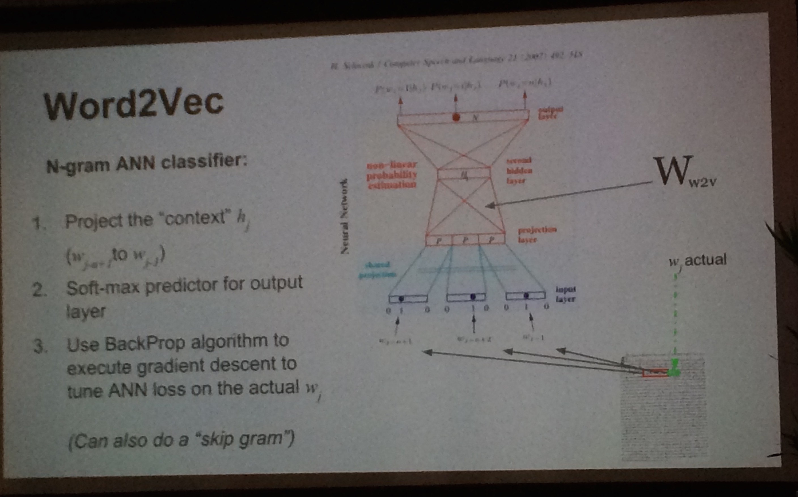
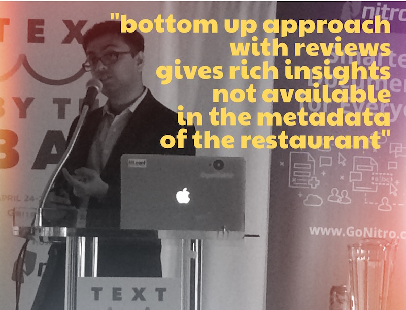
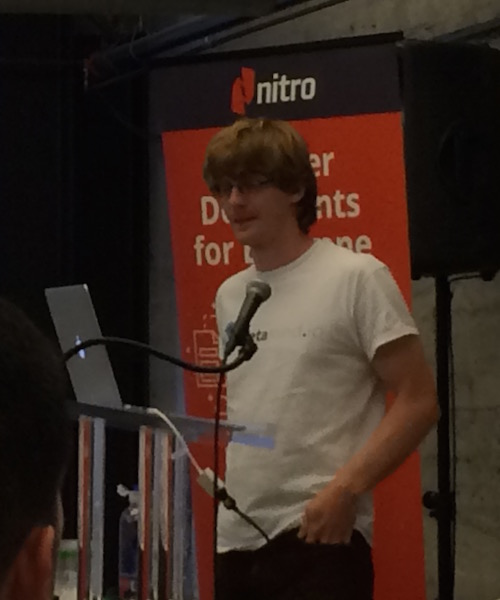

<em>Thoughts following the 2015 "Text By The Bay" Conference</em>

The first "<a href="https://web.archive.org/web/20160812082633/http://text.bythebay.io/schedule.html">Text&nbsp;By the Bay</a>” conference, a&nbsp;new <a href="http://en.wikipedia.org/wiki/Natural_language_processing" target="_blank">natural language processing</a> (NLP) event from the “<a href="https://web.archive.org/web/20160812082633/http://scala.bythebay.io/">Scala bythebay</a>” organizers, just wrapped up tonight. In bringing together practitioners&nbsp;and theorists from academia and industry I’d call it a success,&nbsp;save&nbsp;one significant and glaring problem.&nbsp;

<!--more-->

<h2>1. <em>word2vec</em> and <em>doc2vec</em> appear to be&nbsp;pervasive</h2>

<a href="https://web.archive.org/web/20160812082633/https://www.linkedin.com/profile/view?id=311312132&amp;authType=NAME_SEARCH&amp;authToken=8etT&amp;locale=en_US&amp;trk=tyah&amp;trkInfo=clickedVertical%3Amynetwork%2Cidx%3A1-1-1%2CtarId%3A1430026948052%2Ctas%3Amikolov">Mikolov</a> et al.’s work on embedding words&nbsp;as real-numbered&nbsp;vectors using a <a href="http://www.quora.com/What-are-the-continuous-bag-of-words-and-skip-gram-architectures-in-laymans-terms" target="_blank">skip-gram, negative-sampling</a>&nbsp;model&nbsp;(<a href="https://code.google.com/p/word2vec/" target="_blank"><em>word2vec</em></a> code) was mentioned in nearly every talk I attended. Either companies are using various <em>word2vec</em> implementations directly or they are building diffs off of the basic framework. Trained on large corpora, the vector representations encode&nbsp;concepts in a large dimensional space (usually 200-300 dim). Beyond the <a href="http://insightdatascience.com/blog/thisplusthat_a_search_engine_that_lets_you_add_words_as_vectors.html"><em>“king - man = queen -&nbsp;woman” </em>analogy party trick</a>,&nbsp;such embeddings are finding real-world applications throughout NLP. &nbsp;For example, <a href="https://twitter.com/intent/user?screen_name=MikeTamir">Mike Tamir</a>&nbsp;("Classifying Text without (many) Labels"; slide shown below), discussed how he&nbsp;is using the average&nbsp;representation over entire docs as features for text&nbsp;classification, out-performing other bag-of-words (BoW)&nbsp;techniques by a large measure with&nbsp;heavily imbalanced classes. &nbsp;<a href="https://www.linkedin.com/pub/marek-kolodziej">Marek Kolodziej</a> ("Unsupervised NLP Tutorial using Apache Spark”) gave&nbsp;a wonderful talk about the long history of&nbsp;concept embeddings along with technical details of most of the salient papers.&nbsp; <a href="https://twitter.com/intent/user?screen_name=chrisemoody">Chris Moody</a>&nbsp;("A Word is Worth a Thousand Vectors”) &nbsp;showed how <em>word2vec</em> was being used in conjunction with topic modeling for improved recommendation over standard cohort analysis. He also ended his talk about how <em>word2vec</em> can be extended beyond NLP to machine translation and graph analysis.

<strong>Fig 1. <em>word2vec</em> description slide from Mike Tamir.</strong>

<h2>2. Production-grade NLP is&nbsp;Spreading&nbsp;in Industry</h2>

For years,&nbsp;the most obvious users of natural language processing were those involved in search, tagging, sentiment on social graphs, and&nbsp;recommendations. And there are clear&nbsp;applications to voice recognition. What was most exciting to see at <a href="https://twitter.com/hashtag/tbtb" target="_blank">#tbtb</a>, however, were the companies making use of NLP&nbsp;in production for&nbsp;core product enhancements that stretched beyond traditional uses.

&nbsp; &nbsp;<a href="https://twitter.com/intent/user?screen_name=datamusing" target="_blank">Sudeep Das</a> gave a great talk about the places within <a href="http://opentable.com/" target="_blank">OpenTable</a> where NLP is improving their customer’s experience in subtle but measurable ways. Creating topics around word embeddings of customer reviews they can get much richer insights about a&nbsp;restaurant&nbsp;than what appears in the metadata of that restaurant's&nbsp;website. And in showing reviews they can then bias towards (longer) reviews that hit on all the important topics&nbsp;for that restaurant. Das showed an auto-discovered review for a restaurant (one of my favorites, <a href="http://lamarsf.com/" target="_blank">La Mar</a>!) that spoke to specific famous&nbsp;dishes, the view of the Bay,&nbsp;and the proximity to the Ferry Building. Also impressive was that when the data science team discovered an explosion of <a href="https://www.google.com/search?num=100&amp;espv=2&amp;q=cauliflower+new+york+city+open+table">cauliflower-infused&nbsp;dishes in New York City</a> (yes,&nbsp;that’s a thing apparently), the marketing team was then able to capitalize on the trend by sending out a timely email campaign.

&nbsp; &nbsp;One of my favorite talks was by Chris Moody from <a href="https://www.stitchfix.com/">Stichfix</a>. The company sends 5 fashion items at a time&nbsp;to women. They send back what they don’t want. He showed how, using <em>word2vec</em>, they are using user comments on&nbsp;their products&nbsp;coupled with buying behavior&nbsp;to enrich the suggestions of new items. These are then used by personal fashion consultants as an augmentative tool in their decisions of what to send next. They train the <em>word2vec</em> embedding on the wikipedia corpus and argument that with training using existing reviews and comments.

(Note: both Sudeep and Chris are former astronomers, but that has little bearing on my glowing reviews of their talks!)

<strong>Fig. 2. Sudeep Das, "Learning from the Diner's Experience". Via <a href="https://twitter.com/wiseio/status/592065755002187777">Twitter</a>.</strong>

<h2>3. Open&nbsp;tools are being used but probably not compensated in the way they should</h2>

For training models, a number&nbsp;of large open datasets and code are used by virtually everyone (including by us at&nbsp;<a href="http://wise.io/">wise.io</a>).&nbsp;<a href="https://www.freebase.com/">Freebase</a>&nbsp;(“wikipedia for structured data”), <a href="https://www.wikidata.org/wiki/Wikidata:Main_Page">wikidata</a>, and <a href="http://commoncrawl.org/">common crawl</a>&nbsp;were mentioned throughout the conference, in talks from folks at Crunchbase and <a href="https://twitter.com/intent/user?screen_name=AdithyaRao">Klout</a> for example. The most commonly used implementation of <em>word2vec</em> is in the open-source <a href="https://radimrehurek.com/gensim/">gensim</a> project&nbsp;(with some growing interest in the <a href="https://spark.apache.org/docs/1.1.0/mllib-feature-extraction.html" target="_blank">Spark implementation</a> as well).&nbsp; Most of these projects are just scraping by without a stable source of funding, which seems ridiculous. It seems that few&nbsp;of these open&nbsp;data and software communities are compensated by the (large) corporations that use these tools. This is perfectly legal of course given the licensing but one wonders if there isn’t a better funding model for all of us to consider in the future (like at&nbsp;<a href="https://www.bountysource.com/">bountysource</a>).

<h2>4. "RNNs for X"</h2>

It’s an exciting time for deep learning and NLP, evidence throughout the conference but highlighted in the talk by&nbsp;<a href="http://www.socher.org/">Richard Socher</a>, a co-founder and CTO of <a href="http://metamind.io/">MetaMind</a>. Based on work he did with <a href="http://engineering.stanford.edu/research-profile/stanford-scientists-tested-free-text-analysis-tool-web">recursive neural networks at Stanford</a>, Socher discussed how tree-based learning is performing exceedingly well on sentiment (recent work using <a href="http://arxiv.org/pdf/1503.00075v2.pdf">Long Short-Term Memory Networks&nbsp;</a>[<a href="http://arxiv.org/pdf/1503.00075v2.pdf">LSTM] here</a>).&nbsp; <a href="http://en.wikipedia.org/wiki/Jeremy_Howard_%28entrepreneur%29">Jeremy Howard</a>, founder of <a href="http://www.enlitic.com/">Enlitic</a> (using deep learning for medical diagnosis intelligence), discussed using recurrent neural nets to upend long-standing industries. In his panel discussion with <a href="https://www.linkedin.com/in/peterskomoroch" target="_blank">Pete Skomoroch</a> he touted&nbsp;the power of RNNs, likening this moment in history as the early days of the web when <em>Internet + (anything)</em> changed <em>(anything)&nbsp;</em>forever. Will <em>RNN + (anything)</em> disrupt&nbsp;<em>(anything)</em> again? We’ll see!

<strong>Fig. 3. Richard Socher, "Deep Learning for Natural Language Processing"</strong>

<strong>&nbsp;</strong>

<h2>5. A Big Problem: Massive Gender Imbalance</h2>

Out of 57 speakers and panelists who spoke at the conference, there was exactly twofour (*) women, <a href="https://www.linkedin.com/pub/vita-markman/8/b48/8a4">Vita Markman</a> and&nbsp;<a href="https://www.linkedin.com/pub/katrin-tomanek/86/193/98a">Katrin Tomanek</a>. In <strong>two full</strong> <strong>days</strong>. I really don’t know how this is possible in&nbsp;a day and age where there are so many outstanding female machine learning experts and NLP practitioners&nbsp;(A <a href="https://twitter.com/zelandiya/status/592166127280590848">few of us had a mini-tweetstorm</a> about this&nbsp;where a number of top female speakers in the Bay Area were named.)&nbsp;I don’t want to speculate as to why this happened at this particular conference but it’s clearly not a positive thing for anyone involved, including the sponsors and, frankly, the participants.&nbsp;<a href="https://www.linkedin.com/profile/view?id=6532910">Charles Covey-Brandt</a>&nbsp;(at <a href="https://disqus.com/">Disqus</a>)&nbsp;has a great rule which is that he will refuse to serve on a panel or give a talk in a conference that does not achieve fair representation. If all of us did the same thing, conferences would be better off and we’d be done with this awful foolishness.

(*) Edit after original post: Alexy Khrabrov noted in the comments that two other women spoke at the conference,&nbsp;Diana Hu of Verizon and Katelyn Lyster. Neither are listed in the published schedule at&nbsp;<a href="https://web.archive.org/web/20160812082633/http://text.bythebay.io/schedule.html">http://text.bythebay.io/schedule.html</a>. So a total of 4 out of 59 spoke.&nbsp;Alexy also notes efforts that the organizers took to solicit broader participation.

That’s it for my wrap up summary. Feel free to comment if I missed anything important (or even not-so-important).&nbsp;Caveat: I attended both days but, given the multitrack talk schedule, I was unable to&nbsp;see all the talks.

        

Originally posted at wise.io/blog ... see the [archive.org link](https://web.archive.org/web/20160812082633/http://www.wise.io/tech/five-takeaways-on-the-state-of-natural-language-processing).
