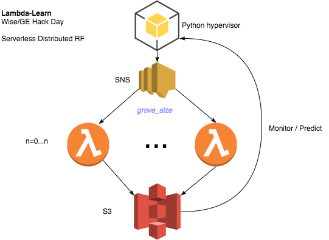
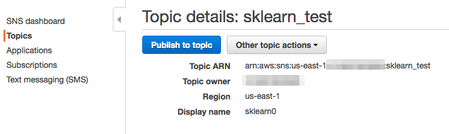
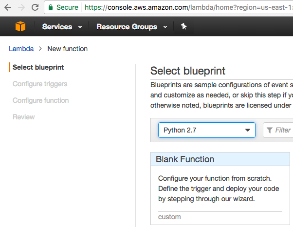
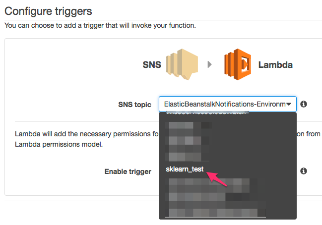

Within the Wise.io team in GE Digital, we have monthly "edu-hackdays" where the entire tech team spends the entire day trying to learn and implement new promising approaches to some portion of our machine-learning based workflow. In the past, we worked on algorithm hacks and on methods for distributed featurization. Some of what we start those days eventually go into production, but most does not. The main goal (apart from the team building that comes with the fun and pain of all-day hacks) is to create collective knowledge and experience around important components of our stack. Recently we had an edu-hackday on strategies for distributed learning. This post captures (and hopefully provides some motivation for) the work I did at that hackday in April.

<!--more-->

<h2>Distributed Decision Forests</h2>

In constructing a classification or regression model with an ensembles of <a href="https://en.wikipedia.org/wiki/Decision_tree_learning" target="_blank">trees</a> ("decision forests"), learning at the tree level trivially parallelizes so long as the entirety of the dataset is close to each compute unit. The process of building trees with independent random seeds on independent (or memory-shared) copies of the training data should yield models of equal quality as those built sequentially. In principle, parallel learning (and prediction) should strongly scale in the&nbsp;number of trees versus processes (not true, of course, for scaling with respect to the number of data points).

Many popular open-source implementations of decision forests can learn in parallel in multi-core, signal-node environments. For example, Python's <a href="http://scikit-learn.org/stable/index.html" target="_blank">scikit-learn </a>leverages <em><a href="https://pythonhosted.org/joblib/" target="_blank">joblib</a></em> to <a href="http://scikit-learn.org/stable/modules/generated/sklearn.ensemble.RandomForestClassifier.html" target="_blank">build trees</a> in parallel (multi-threaded or multi-processed). Distributed <em>embarrassingly</em> parallel learning across nodes can be <a href="http://matthewrocklin.com/blog/work/2016/04/20/dask-distributed-part-5" target="_blank">done</a> with <a href="http://distributed.readthedocs.io/en/latest/index.html" target="_blank">dask.distributed.</a> (Distributed implementations in <a href="http://docs.h2o.ai/h2o/latest-stable/h2o-docs/data-science/drf.html" target="_blank">H20</a> and in <a href="https://databricks.com/blog/2015/01/21/random-forests-and-boosting-in-mllib.html" target="_blank">Spark/MLlib</a> build single trees across on distributed data based on the MapReduce-based algorithms from Google's <a href="http://static.googleusercontent.com/media/research.google.com/en/us/pubs/archive/36296.pdf" target="_blank">MapReduce PLANET paper</a>).

One of the main drawbacks of distributed learning is the need to persist, scale, and maintain clusters of potentially expensive compute resources. For heavily and consistently used clusters in large companies or research environments, these operational expenses (including the people costs) may be economical. But for many for many others, with sporadic learning workloads, the computational and personnel overhead can be a huge burden.

<h2>Enter Serverless</h2>

The event-driven, asynchronous <a href="https://en.wikipedia.org/wiki/Serverless_computing">serverless</a> compute paradigm represents a fundamental departure from the way data is served and processed. Rather than host and manage the oft-idle computational substrate in where the heavily lifting is occasionally done, serverless allows us to leverage lightweight functions on an as-need basis. This pushes management, orchestration, and scaling down to the PaaS layer and allows us to focus almost entirely on functionality and content.

Though there are now many <a href="https://www.forbes.com/sites/janakirammsv/2016/03/22/five-serverless-computing-frameworks-to-watch-out-for/3/#1804751428b3" target="_blank">competing offerings</a>, AWS Lambda was the first commercial-scale serverless framework. Since we're an AWS shop (for the most part), for my hack I wanted to see if I could use AWS Lambda to build a serverless distributed decision forest implementation.

The overall strategy here is pretty simple: each lambda function should generate its own independent random decision tree. While Wise.io has its own proprietary implementation of popular learning algorithms, for this I decided to use scikit-learn to generate trees. A Python script serves as the hypervisor to launch and collect the results from tree building. The idea of the flow is here.

<h3>Creating the Lambda Function</h3>

One of the main challenges with getting AWS Lambda functions to work is that, while they can run out-of-the-box Python, many non-standard packages cannot be easily imported at runtime. <a href="https://twitter.com/ryan_sb" target="_blank">Ryan Brown</a> had a recent post that presented the <a href="https://serverlesscode.com/post/scikitlearn-with-amazon-linux-container/" target="_blank">steps to create a Docker image</a> that emulates the Amazon Linux runtime environment, thereby allowing us to compile third-party Python packages needed to build trees.

Now we need to make the virtual environment that we'll use to upload to AWS:

Next create a Python script <a href="https://gist.github.com/profjsb/ca4baa728f9ffe11f0bd6a8feaad279b#file-main-py" target="_blank">main.py</a> and put inside the ve_package/ directory.

There are only a few functions here:

<ol>
<li>&nbsp;<em>_save_model_to_s3()</em>: uses joblib to serialize the model and stores it to s3 with a unique name.&nbsp;</li>
<li><em>load_data()</em>: here just using sklearn's version of MNIST. But you could pull data from s3 or HBASE here too.</li>
<li><em>learn_model()</em>: learns the decision forest model</li>
<li><em>handler()</em>: the function that will be called by AWS Lambda</li>
</ol>

In the handler, we're passing down a random seed. This seed will be propagated&nbsp;from the hypervisior to ensure that each tree is built with its own seed. Rather than have each lambda invocation&nbsp;create one tree, we create small collection of trees (which we call "groves") by setting the parameter n_estimators (=10 by default). So that with m=15 invocations&nbsp;of lambda we get m ⨉ n_estimators = 150 trees in the final forest.&nbsp;

<h3>Setting up AWS Lambda, IAM, and SNS</h3>

Create a role for your lambda user that will allow it to access S3 (in case you want to have your lambda function access the training data in S3):

<link rel="stylesheet" href="https://github.githubassets.com/assets/gist-embed-123720f37c57ce9a8f29de081c38ed61.css">

    

      

        

  

  

<table class="highlight tab-size js-file-line-container" data-tab-size="8">
      <tbody><tr>
        <td id="file-lambda_iam_role-json-L1" class="blob-num js-line-number" data-line-number="1"></td>
        <td id="file-lambda_iam_role-json-LC1" class="blob-code blob-code-inner js-file-line">{</td>
      </tr>
      <tr>
        <td id="file-lambda_iam_role-json-L2" class="blob-num js-line-number" data-line-number="2"></td>
        <td id="file-lambda_iam_role-json-LC2" class="blob-code blob-code-inner js-file-line">    "Version": "2012-10-17",</td>
      </tr>
      <tr>
        <td id="file-lambda_iam_role-json-L3" class="blob-num js-line-number" data-line-number="3"></td>
        <td id="file-lambda_iam_role-json-LC3" class="blob-code blob-code-inner js-file-line">    "Statement": [</td>
      </tr>
      <tr>
        <td id="file-lambda_iam_role-json-L4" class="blob-num js-line-number" data-line-number="4"></td>
        <td id="file-lambda_iam_role-json-LC4" class="blob-code blob-code-inner js-file-line">        {</td>
      </tr>
      <tr>
        <td id="file-lambda_iam_role-json-L5" class="blob-num js-line-number" data-line-number="5"></td>
        <td id="file-lambda_iam_role-json-LC5" class="blob-code blob-code-inner js-file-line">            "Effect": "Allow",</td>
      </tr>
      <tr>
        <td id="file-lambda_iam_role-json-L6" class="blob-num js-line-number" data-line-number="6"></td>
        <td id="file-lambda_iam_role-json-LC6" class="blob-code blob-code-inner js-file-line">            "Action": [</td>
      </tr>
      <tr>
        <td id="file-lambda_iam_role-json-L7" class="blob-num js-line-number" data-line-number="7"></td>
        <td id="file-lambda_iam_role-json-LC7" class="blob-code blob-code-inner js-file-line">                "logs:CreateLogGroup",</td>
      </tr>
      <tr>
        <td id="file-lambda_iam_role-json-L8" class="blob-num js-line-number" data-line-number="8"></td>
        <td id="file-lambda_iam_role-json-LC8" class="blob-code blob-code-inner js-file-line">                "logs:CreateLogStream",</td>
      </tr>
      <tr>
        <td id="file-lambda_iam_role-json-L9" class="blob-num js-line-number" data-line-number="9"></td>
        <td id="file-lambda_iam_role-json-LC9" class="blob-code blob-code-inner js-file-line">                "logs:PutLogEvents"</td>
      </tr>
      <tr>
        <td id="file-lambda_iam_role-json-L10" class="blob-num js-line-number" data-line-number="10"></td>
        <td id="file-lambda_iam_role-json-LC10" class="blob-code blob-code-inner js-file-line">            ],</td>
      </tr>
      <tr>
        <td id="file-lambda_iam_role-json-L11" class="blob-num js-line-number" data-line-number="11"></td>
        <td id="file-lambda_iam_role-json-LC11" class="blob-code blob-code-inner js-file-line">            "Resource": "arn:aws:logs:*:*:*"</td>
      </tr>
      <tr>
        <td id="file-lambda_iam_role-json-L12" class="blob-num js-line-number" data-line-number="12"></td>
        <td id="file-lambda_iam_role-json-LC12" class="blob-code blob-code-inner js-file-line">        },</td>
      </tr>
      <tr>
        <td id="file-lambda_iam_role-json-L13" class="blob-num js-line-number" data-line-number="13"></td>
        <td id="file-lambda_iam_role-json-LC13" class="blob-code blob-code-inner js-file-line">        {</td>
      </tr>
      <tr>
        <td id="file-lambda_iam_role-json-L14" class="blob-num js-line-number" data-line-number="14"></td>
        <td id="file-lambda_iam_role-json-LC14" class="blob-code blob-code-inner js-file-line">            "Effect": "Allow",</td>
      </tr>
      <tr>
        <td id="file-lambda_iam_role-json-L15" class="blob-num js-line-number" data-line-number="15"></td>
        <td id="file-lambda_iam_role-json-LC15" class="blob-code blob-code-inner js-file-line">            "Action": [</td>
      </tr>
      <tr>
        <td id="file-lambda_iam_role-json-L16" class="blob-num js-line-number" data-line-number="16"></td>
        <td id="file-lambda_iam_role-json-LC16" class="blob-code blob-code-inner js-file-line">                "s3:GetObject",</td>
      </tr>
      <tr>
        <td id="file-lambda_iam_role-json-L17" class="blob-num js-line-number" data-line-number="17"></td>
        <td id="file-lambda_iam_role-json-LC17" class="blob-code blob-code-inner js-file-line">                "s3:PutObject",</td>
      </tr>
      <tr>
        <td id="file-lambda_iam_role-json-L18" class="blob-num js-line-number" data-line-number="18"></td>
        <td id="file-lambda_iam_role-json-LC18" class="blob-code blob-code-inner js-file-line">                "s3:ListBucket"</td>
      </tr>
      <tr>
        <td id="file-lambda_iam_role-json-L19" class="blob-num js-line-number" data-line-number="19"></td>
        <td id="file-lambda_iam_role-json-LC19" class="blob-code blob-code-inner js-file-line">            ],</td>
      </tr>
      <tr>
        <td id="file-lambda_iam_role-json-L20" class="blob-num js-line-number" data-line-number="20"></td>
        <td id="file-lambda_iam_role-json-LC20" class="blob-code blob-code-inner js-file-line">            "Resource": [</td>
      </tr>
      <tr>
        <td id="file-lambda_iam_role-json-L21" class="blob-num js-line-number" data-line-number="21"></td>
        <td id="file-lambda_iam_role-json-LC21" class="blob-code blob-code-inner js-file-line">                "arn:aws:s3:::YOUR-BUCKET-NAME/*"</td>
      </tr>
      <tr>
        <td id="file-lambda_iam_role-json-L22" class="blob-num js-line-number" data-line-number="22"></td>
        <td id="file-lambda_iam_role-json-LC22" class="blob-code blob-code-inner js-file-line">            ]</td>
      </tr>
      <tr>
        <td id="file-lambda_iam_role-json-L23" class="blob-num js-line-number" data-line-number="23"></td>
        <td id="file-lambda_iam_role-json-LC23" class="blob-code blob-code-inner js-file-line">        }</td>
      </tr>
      <tr>
        <td id="file-lambda_iam_role-json-L24" class="blob-num js-line-number" data-line-number="24"></td>
        <td id="file-lambda_iam_role-json-LC24" class="blob-code blob-code-inner js-file-line">    ]</td>
      </tr>
      <tr>
        <td id="file-lambda_iam_role-json-L25" class="blob-num js-line-number" data-line-number="25"></td>
        <td id="file-lambda_iam_role-json-LC25" class="blob-code blob-code-inner js-file-line">}</td>
      </tr>
</tbody></table>

  

  

      

        <a href="https://gist.github.com/profjsb/ca4baa728f9ffe11f0bd6a8feaad279b/raw/688088fee49cb8086a19387e1cc16d250b5fbd9d/lambda_iam_role.json" style="float:right">view raw</a>
        <a href="https://gist.github.com/profjsb/ca4baa728f9ffe11f0bd6a8feaad279b#file-lambda_iam_role-json">lambda_iam_role.json</a>
        hosted with ❤ by <a href="/save/https://github.com">GitHub</a>
      

    

We'll want to invoke our lambda functions via an SNS message. First set up an SNS topic for this project:

Next, navigate to AWS Lambda and create a blank Python 2.7 function.

Create an SNS trigger for this lambda function:

Set the handler to be main.handler and then upload the package. To prepare for upload, with main.py inside ve_package:

<pre><code>zip -r&nbsp; ../ve_archive.zip * --exclude \*.pyc</code></pre>

Upload ve_archive.zip (you can also first upload to S3 and then pull from this S3 key).

Go ahead and test it. You should see an output like:

<pre class="invoke-output">START RequestId: d4813335-56d1-11e7-8de1-ff2e8b921d75 Version: $LATEST
{'build_id': 'test_m1', 'nest': 10, 'grove_id': 2, 'nrows': 56000, 'seed': 10, 'gamma': 0.8}
Saving model to local file: /tmp/build_test_m1_grove_2.sav
Uploading /tmp/build_test_m1_grove_2.sav --&gt; s3://YOUR-S3-BUCKET/lambda_learn/models/test_m1/grove_2.sav
{('test_m1', 2): 'lambda_learn/models/test_m1/grove_2.sav'}
END RequestId: d4813335-56d1-11e7-8de1-ff2e8b921d75
REPORT RequestId: d4813335-56d1-11e7-8de1-ff2e8b921d75  Duration: 1504.94 ms    Billed Duration: 1600 ms    Memory Size: 512 MB Max Memory Used: 69 MB</pre>

Note that it took about 1.3 seconds to build 10 trees on this little MNIST dataset. We also used 69 MB of memory, well under the default cap of 512 MB.

<h2 class="p1">Running and testing a distributed job</h2>

We now need a script to invoke a certain number of lambda jobs and then wait for those jobs to complete. After completion, it should assemble the results into a single model and make predictions. This script is in the file <a href="https://gist.github.com/profjsb/ca4baa728f9ffe11f0bd6a8feaad279b#file-lamlearn-py" target="_blank"><em>lamlearn.py</em></a>. This can be run as a CLI:

<pre class="p1"><code>$ python lamlearn.py --help usage: lamlearn.py [-h] [-g GROVE] [-t TREES] [-p] [-s] name</code> <code>positional arguments:</code> <code> &nbsp;name&nbsp; &nbsp; &nbsp; &nbsp; &nbsp; &nbsp; &nbsp; &nbsp; &nbsp; model name (e.g. smelly-owl-1)</code> <code>optional arguments:</code> <code> &nbsp;-h, --help&nbsp; &nbsp; &nbsp; &nbsp; &nbsp; &nbsp; show this help message and exit</code> <code> &nbsp;-g GROVE, --grove GROVE</code> <code> &nbsp; &nbsp; &nbsp; &nbsp; &nbsp; &nbsp; &nbsp; &nbsp; &nbsp; &nbsp; &nbsp; &nbsp;grove size [default=10]</code> <code> &nbsp;-t TREES, --trees TREES</code> <code> &nbsp; &nbsp; &nbsp; &nbsp; &nbsp; &nbsp; &nbsp; &nbsp; &nbsp; &nbsp; &nbsp; &nbsp;n trees total [default=30]</code> <code> &nbsp;-p, --pred&nbsp; &nbsp; &nbsp; &nbsp; &nbsp; &nbsp; predict</code> <code> &nbsp;-s, --s &nbsp; &nbsp; &nbsp; &nbsp; &nbsp; &nbsp; &nbsp; run synchronously</code></pre>

Building a 500-tree decision forest over 50 lambdas and then making a prediction you'd get an output like:

<pre class="p1"><code>$ python lamlearn.py jsb-blog-run2 -t 500 -p n_groves: 50</code> <code>{'build_id': 'jsb-blog-run', 'nest': 10, 'seed': 486191, 'grove_id': 0}</code> <code>{'build_id': 'jsb-blog-run', 'nest': 10, 'seed': 451283, 'grove_id': 1}</code> <code>{'build_id': 'jsb-blog-run', 'nest': 10, 'seed': 165158, 'grove_id': 2}</code> <code>....</code> <code>{'build_id': 'jsb-blog-run', 'nest': 10, 'seed': 978124, 'grove_id': 49}</code> <code>triggering 50 groves asynchronously</code> <code>Waiting for all the λ's to complete</code> <code>🤑&nbsp; Completed in 15.740929 sec ... found all 50 groves</code> <code>🤑 &nbsp; &nbsp; time since last λ fired until complete: 15.161692 sec</code> <code>The joblib save files for each grove are in: s3://YOUR-S3-BUCKET/lambda_learn/models/jsb-blog-run</code> <code>Prediction...</code> <code>Getting all the grove models from s3...</code> <code>Merging grove models...</code> <code>RandomForestClassifier(bootstrap=True, class_weight=None, criterion='gini',</code> <code> &nbsp; &nbsp; &nbsp; &nbsp; &nbsp; &nbsp;max_depth=None, max_features='auto', max_leaf_nodes=None,</code> <code> &nbsp; &nbsp; &nbsp; &nbsp; &nbsp; &nbsp;min_impurity_split=1e-07, min_samples_leaf=1,</code> <code> &nbsp; &nbsp; &nbsp; &nbsp; &nbsp; &nbsp;min_samples_split=2, min_weight_fraction_leaf=0.0,]</code> <code> &nbsp; &nbsp; &nbsp; &nbsp; &nbsp; &nbsp;n_estimators=30, n_jobs=1, oob_score=False, random_state=None,</code> <code>verbose=0, warm_start=False)</code> <code>Score: 1.000000</code></pre>
<h3>Caveats and Next Steps</h3>

The lambda learner and assembler are obviously just toy examples. You obviously <strong>shouldn't be using this in production</strong> (or even for exploratory analysis). I've taken some short cuts here. For example, you'll notice in <em>main.py</em> that we learn over the entire dataset. If you wanted a good measure of the accuracy on unseen data, you would obviously want to have consistent train-test splits across each lambda function. You'll also notice the rather clunky way of concatinating grove-level models into a single monolithic model. It would be more elegant (and much more fast) to build a lambda predict capability that invokes all the grove-level models in individual lambda functions and then aggregates the votes from each grove accordingly. Instead of building a distributed forest you could instead imagine using serverless to do <a href="http://www.jmlr.org/papers/volume13/bergstra12a/bergstra12a.pdf" target="_blank">random</a> or grid searches over decision forest hyperparameters; that is, allow each lambda to build an entire forest but with different hyperparameters of the model.&nbsp;

The good news is that running this few number of lambdas is basically free on AWS (for now), whereas it might have cost us a few dollars build models of this size with a reasonable AWS machine should we have built models the not serveless way. However, we are much more limited in serverless in our ability to build models that take a long time or take too much memory. At present, we can <a href="http://docs.aws.amazon.com/lambda/latest/dg/limits.html" target="_blank">allocate only up to 1.536 GB per lambda and each job must complete within 5 minutes</a>. So for much larger datasets the time to read data from S3 (or other stores) may be a signficant bottleneck and the learner would need to be memory efficient. By default only 1000 lambdas can be running concurrently so if we built REALLY large forests with small groves, or were running multiple learning jobs simultaneously, we could get throttled here as well.

I did not perform any scientific scaling tests, but did note that a 5000-tree forest built in ~25 seconds was about 3 times slower than a 150-tree forest. My hunch is that this has more to do with the overheads in firing off SNS messages from my two-core laptop over a so-so connection than with anything fundamental on the AWS side.

The setup time for lambda is not insignificant and adding 3rd party packages is indeed a pain (debugging is also a real pain). Projects like <a href="http://pywren.io/">PyWren</a>, headed by Eric Jonas,&nbsp;from UC Berkeley's RISElab, aim to make set up and execution of serverless jobs much more straightforward. <a href="https://arxiv.org/abs/1702.04024" target="_blank">Eric's paper</a> also shows a number of scaling and throughput tests.

        

 Originally posted at wise.io/tech blog ... see the [archive.org link](https://web.archive.org/web/20170729194339/http://www.wise.io/tech/serverless-distributed-decision-forests-with-aws-lambda).
