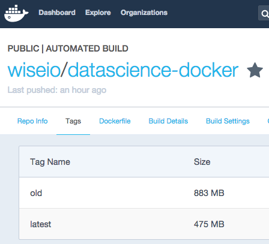

The architectural and organizational/process advantages of containerization (eg., via <a href="https://www.docker.com/" target="_blank">Docker</a>) are commonly known. However, in constructing images, especially those that serve as the base for other images, adding functionality via package installation is a double edged sword. On one hand we want our images to be most useful for the purposes they are built but—as images are downloaded, moved around our networks and live in our <a href="http://blog.librato.com/posts/docker-images">production environments</a>—we pay a real speed and cost price for bloated image sizes. The obvious onus on image creators is to make them as practically small as possible without sacrificing efficicacy and extensibility. This blog shows how we shrunk our images with a pretty simple trick...

<!--more-->The great impetus towards smaller images manifests in a few places:

<ol>
<li><strong>OS distros,</strong> such a <a href="https://blog.phusion.nl/2015/01/20/baseimage-docker-fat-containers-treating-containers-vms/" target="_blank">phusion</a> (minimal, Docker-friendly Ubuntu), <a href="https://hub.docker.com/_/busybox/">busybox</a> (intended for embedded systems), and <a href="https://hub.docker.com/_/alpine/" target="_blank">alpine</a>. These provide operating systems that are minimally functional yet can be easily extended.&nbsp;</li>
<li><strong>Programming/Environments</strong>, such as&nbsp;<a href="http://www.iron.io/microcontainers-tiny-portable-containers/">microcontainers</a> from <a href="http://iron.io/" target="_blank">Iron.io</a>.</li>
<li><strong>Shrink wrapping</strong>, such as <a href="https://github.com/djosephsen/skinnywhale">skinnywhale</a>, <em>docker export</em>, <a href="https://github.com/mvanholsteijn/strip-docker-image">strip-docker-image</a>,&nbsp;work with existing image layers/containers and try to compress them by finding redunancies and commonalities.</li>
</ol>

When creating <a href="http://www.wise.io/" target="_blank">Wise.io</a>'s open version of the <a href="https://hub.docker.com/r/wiseio/datascience-docker/">Python datascience base&nbsp;image</a>&nbsp;I found that the OS distro choice does not affect the final image size much, since there are so many dependencies required to get a fully functional data science environment up and running. In advance of&nbsp;a focus on post-image creation shrink wrapping, I wound up looking for ways to shrink down the resulting image in the Dockerfile itself.

The essential point is that since each RUN creates a new layer, one needs to condense logical&nbsp;installation <em>and</em> tear down steps into one line. You can do this easily with chained&nbsp;<a href="http://bashitout.com/2013/05/18/Ampersands-on-the-command-line.html" target="_blank">double ampersands</a> (&amp;&amp;) in the shell. By tearing down/cleaning up in another RUN, your final image will still have the bloat from the previous layers. We needed three major installation/clean up steps in our <a href="https://github.com/wiseio/datascience-docker/blob/master/datascience-base/Dockerfile">Dockerfile</a>:

1. System level dependencies

Here you'll notice that in addition to updating the OS, installing new packages, and setting locales, we also purge the cache of apt installation files.

&nbsp;2. (Python) Conda distro and data science friendly Python packages like jupyter notebook,&nbsp;pandas, numpy, matplotlib, plotly, sklearn, scikit-image, nltk, gensim, psycopg2:

Here we get the latest <a href="hhttp://conda.pydata.org/miniconda.html" target="_blank">miniconda</a> from <a href="https://www.continuum.io/" target="_blank">Continuum.io</a>, install our favorite data science packages for Python and then tidy up. Using "conda clean" in this layer leads to a major space savings.

&nbsp;3. All the Python packages we want that are not in the standard conda distro channel (e.g. gensim, plotly), but are available via pip:

Here we make sure to remove the cache directory after we're done.

The "trick" is really just two components:

<ol>
<li>Put all logically connected installations (e.g. from one package manager) into their own RUN, to produce fewer layers.</li>
<li>Figure out what the tear down/clean up commands are for those installations/package managers and tack them on to the end of the RUN (e.g., conda clean, rm, ...).</li>
</ol>

All told, we&nbsp;saved about 46% space (475&nbsp;MB) just by setting up and tearing down in the same RUN.&nbsp;

If you're a Pythonista/data scientist and would like to give our base image a shot just:

<pre><code>   docker pull wiseio/datascience-docker </code></pre>

<a href="https://github.com/wiseio/datascience-docker/tree/master/datascience-base">And get started</a>&nbsp;with jupyter notebooks and more.

We'd love to hear from you if you've got any other tricks to strink down this image.

<em>Thanks to Paul Baines and Henrik Brink for comments on earlier drafts.</em>

        

