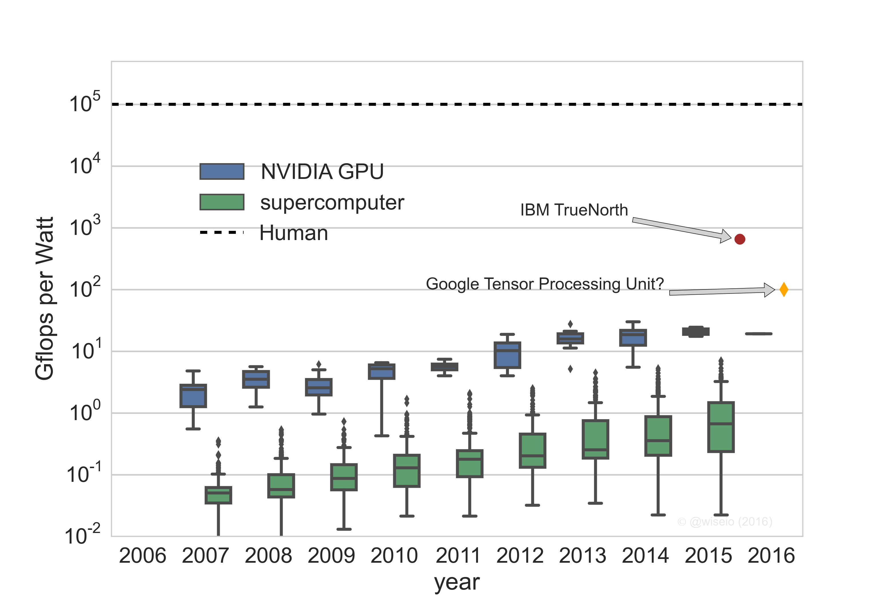

If accuracy improves with more computation, why not throw in more time, people, hardware, and the concomitant energy costs? Seems reasonable but this approach misses the fundamental point of doing machine learning (and more broadly, AI): as a means to an end. &nbsp;And so we need to have a little talk about cost-optimization, encompassing a much wider set of cost-assignable components than usually discussed in academia, industry, and the press. Viewing AI as a global optimization over cost (ie., dollars) puts the work throughout all parts of the value chain in perspective (including the driving origins of new specialized chips—like IBM TrueNorth Google's Tensor Processing Unit). Done right it will lead to, by definition, better outcomes.

<!--more-->

The broad artificial intelligence landscape, to zeroth order, is focused around optimization of some form of quantifiable accuracy: given the data inputs, train a learner that best optimizes some metric on the testing, validation and on-line data. The posture is this: so long as we can get our learner to perform on some hardware in some finite amount of time, with a finite amount of energy costs, we're good to go. But there are plenty of lessons from history where establishing competitions and benchmarks around a single number does not payoff in practice. A decade ago, Netflix gave a $1M prize to the team that best improved recommendation accuracy. But the <a href="https://web.archive.org/web/20160930141855/http://techblog.netflix.com/2012/04/netflix-recommendations-beyond-5-stars.html">winning approach never made it into production for labor-cost reasons</a>: "<em>We evaluated some of the new methods offline but the additional accuracy gains that we measured did not seem to justify the engineering effort needed to bring them into a production environment.</em>" Running hundreds of algorithms over billions of entries would have been too costly as well. Everyday, people use accuracy-optimization as their North Star.

Indeed with accuracy as the primary driver of optimization, a secondary concern is driving down the<em> time to train</em> and/or <em>time to predict</em>. The former, while directly related to the (dollar) cost of learning, is usually thought of a nice-to-have rather than an imperative (strong scaling algorithms can in principle bring the clock-time for learning down but costs remain fixed since the same number of computations is still made). Time to predict is a metric that is implicitly connected to the value of having answers faster. Way down the list for most are concerns about model size on disk, time to implement solutions, interpretability of the answers, reproducibility, and auditability of the predictions.

Put it this way: would you give up on 0.001% accuracy for a model that takes 1000x less time to train? Would you adopt an accuracy-inferior linear model in production because you could explain the weights to the CEO or a regulatory body? The answer is not obviously no. But until we explicitly articulate those tradeoffs, and are honest with ourselves about what we're trying to optimize when we do machine learning and other AI tasks, we're likely optimizing only part of system. This guarantees that our actual system will be sub-optimal.

<h2>What should we be optimizing for in AI?</h2>

What we optimize for depends on the altitude from which we look down upon the problem. At all levels we are concerned about different things. From the ground up to 100,000 ft:

<ol>
<li><strong>Algorithm/Model</strong>: learning rate, convexity, error bounds/guarantees, scaling</li>
<li><strong>Software/Hardware</strong>: Accuracy/performance on real data, memory usage during train time, memory usage during prediction time, disk usage requirements, CPU needs, time to learn, time to predict</li>
<li><strong>Project</strong>: staffing requirements (data scientists, software engineers, dev ops), time to implement a proof-of-concept/write a paper, marginal added resource costs, reliability/stability of the model in production, model management/maintainability, experimentability</li>
<li><strong>Organization</strong>: opportunity cost, interaction of results with other lines of business in a company, marketing value of project, P/L of the project effort, long term benefits of having done the project (e.g., from a hiring perspective), personnel cost to support</li>
<li><strong>Consumer</strong>: direct value, usability, explainability, actionability of the results</li>
<li><strong>Society</strong>: implications of a results (e.g., residual benefits to GDP, welfare of people)</li>
</ol>

In principle, regardless of whether we're talking about <a href="https://web.archive.org/web/20160930141855/https://en.wikipedia.org/wiki/Machine_learning#Types_of_problems_and_tasks">supervised or unsupervised learning</a>, all the above considerations (and more not listed) are both quantifiable and therefore optimizable. What may not be obvious is the potential for an extreme coupling between considerations not just within one level (e.g., accuracy might increase with model size, but time to predict might increase with model size) but between levels (e.g., a highly accurate model instantiation may take longer to implement which reduces the return from the marketing value of the product in GA). As <a href="https://web.archive.org/web/20160930141855/http://leon.bottou.org/">Léon Bottou</a> emphasized <a href="https://web.archive.org/web/20160930141855/http://icml.cc/2015/invited/LeonBottouICML2015.pdf">at ICML last year</a> and <a href="https://web.archive.org/web/20160930141855/http://research.google.com/pubs/author38217.html">D. Sculley</a> <a href="https://web.archive.org/web/20160930141855/http://research.google.com/pubs/pub43146.html">wrote about for Google</a>, the lack of composability within and between these levels makes AI-systems in production extremely hard to view as traditional software engineering endeavors.

Formulated as an optimization problem, we would turn each of the above-listed considerations into terms of a function that we wish to minimize. We would also add appropriate constraints. &nbsp;The good news is that each component is either already in units of dollars or has a direct path to be expressed in dollars. The bad news is that formulation of a closed functional form of each term may be intractable, especially at the highest levels[1].

Focusing on the lower levels, we might formulate the optimization as such:

<!--

-->

<mo movablelimits=&quot;true&quot; form=&quot;prefix&quot;>min</mo><mi>&amp;#x03D5;</mi><mo>=</mo><mo movablelimits=&quot;true&quot; form=&quot;prefix&quot;>min</mo><mrow><mo>[</mo><msub><mi>&amp;#x03D5;</mi><mrow class=&quot;MJX-TeXAtom-ORD&quot;><mi mathvariant=&quot;normal&quot;>h</mi><mi mathvariant=&quot;normal&quot;>a</mi><mi mathvariant=&quot;normal&quot;>r</mi><mi mathvariant=&quot;normal&quot;>d</mi><mi mathvariant=&quot;normal&quot;>w</mi><mi mathvariant=&quot;normal&quot;>a</mi><mi mathvariant=&quot;normal&quot;>r</mi><mi mathvariant=&quot;normal&quot;>e</mi></mrow></msub><mo>+</mo><msub><mi>&amp;#x03D5;</mi><mrow class=&quot;MJX-TeXAtom-ORD&quot;><mi mathvariant=&quot;normal&quot;>l</mi><mi mathvariant=&quot;normal&quot;>a</mi><mi mathvariant=&quot;normal&quot;>b</mi><mi mathvariant=&quot;normal&quot;>o</mi><mi mathvariant=&quot;normal&quot;>r</mi></mrow></msub><mo>&amp;#x00D7;</mo><msub><mi>t</mi><mrow class=&quot;MJX-TeXAtom-ORD&quot;><mi mathvariant=&quot;normal&quot;>d</mi><mi mathvariant=&quot;normal&quot;>e</mi><mi mathvariant=&quot;normal&quot;>v</mi><mi mathvariant=&quot;normal&quot;>e</mi><mi mathvariant=&quot;normal&quot;>l</mi><mi mathvariant=&quot;normal&quot;>o</mi><mi mathvariant=&quot;normal&quot;>p</mi></mrow></msub><mo>+</mo><msub><mi>&amp;#x03D5;</mi><mrow class=&quot;MJX-TeXAtom-ORD&quot;><mi mathvariant=&quot;normal&quot;>s</mi><mi mathvariant=&quot;normal&quot;>t</mi><mi mathvariant=&quot;normal&quot;>o</mi><mi mathvariant=&quot;normal&quot;>r</mi><mi mathvariant=&quot;normal&quot;>a</mi><mi mathvariant=&quot;normal&quot;>g</mi><mi mathvariant=&quot;normal&quot;>e</mi></mrow></msub><mo stretchy=&quot;false&quot;>(</mo><mi>m</mi><mo stretchy=&quot;false&quot;>)</mo><mo>+</mo><msub><mi>&amp;#x03D5;</mi><mrow class=&quot;MJX-TeXAtom-ORD&quot;><mi mathvariant=&quot;normal&quot;>t</mi><mi mathvariant=&quot;normal&quot;>r</mi><mi mathvariant=&quot;normal&quot;>a</mi><mi mathvariant=&quot;normal&quot;>n</mi><mi mathvariant=&quot;normal&quot;>s</mi><mi mathvariant=&quot;normal&quot;>m</mi><mi mathvariant=&quot;normal&quot;>i</mi><mi mathvariant=&quot;normal&quot;>s</mi><mi mathvariant=&quot;normal&quot;>s</mi><mi mathvariant=&quot;normal&quot;>i</mi><mi mathvariant=&quot;normal&quot;>o</mi><mi mathvariant=&quot;normal&quot;>n</mi></mrow></msub><mo stretchy=&quot;false&quot;>(</mo><mi>m</mi><mo stretchy=&quot;false&quot;>)</mo><mo>&amp;#x2212;</mo><msub><mi>&amp;#x03D5;</mi><mrow class=&quot;MJX-TeXAtom-ORD&quot;><mi mathvariant=&quot;normal&quot;>b</mi><mi mathvariant=&quot;normal&quot;>u</mi><mi mathvariant=&quot;normal&quot;>s</mi><mi mathvariant=&quot;normal&quot;>i</mi><mi mathvariant=&quot;normal&quot;>n</mi><mi mathvariant=&quot;normal&quot;>e</mi><mi mathvariant=&quot;normal&quot;>s</mi><mi mathvariant=&quot;normal&quot;>s</mi><mtext>&amp;#xA0;</mtext><mi mathvariant=&quot;normal&quot;>v</mi><mi mathvariant=&quot;normal&quot;>a</mi><mi mathvariant=&quot;normal&quot;>l</mi><mi mathvariant=&quot;normal&quot;>u</mi><mi mathvariant=&quot;normal&quot;>e</mi></mrow></msub><mo stretchy=&quot;false&quot;>(</mo><msub><mi>S</mi><mi>m</mi></msub><mo>,</mo><msub><mi>I</mi><mi>m</mi></msub><mo>,</mo><msub><mi>t</mi><mi>m</mi></msub><mo stretchy=&quot;false&quot;>)</mo><mo>]</mo></mrow></math>" role="presentation">minϕ=min[ϕhardware+ϕlabor×tdevelop+ϕstorage(m)+ϕtransmission(m)−ϕbusiness&nbsp;value(Sm,Im,tm)]<math xmlns="http://www.w3.org/1998/Math/MathML" display="block"><mo movablelimits="true" form="prefix">min</mo><mi>ϕ</mi><mo>=</mo><mo movablelimits="true" form="prefix">min</mo><mrow><mo>[</mo><msub><mi>ϕ</mi><mrow class="MJX-TeXAtom-ORD"><mi mathvariant="normal">h</mi><mi mathvariant="normal">a</mi><mi mathvariant="normal">r</mi><mi mathvariant="normal">d</mi><mi mathvariant="normal">w</mi><mi mathvariant="normal">a</mi><mi mathvariant="normal">r</mi><mi mathvariant="normal">e</mi></mrow></msub><mo>+</mo><msub><mi>ϕ</mi><mrow class="MJX-TeXAtom-ORD"><mi mathvariant="normal">l</mi><mi mathvariant="normal">a</mi><mi mathvariant="normal">b</mi><mi mathvariant="normal">o</mi><mi mathvariant="normal">r</mi></mrow></msub><mo>×</mo><msub><mi>t</mi><mrow class="MJX-TeXAtom-ORD"><mi mathvariant="normal">d</mi><mi mathvariant="normal">e</mi><mi mathvariant="normal">v</mi><mi mathvariant="normal">e</mi><mi mathvariant="normal">l</mi><mi mathvariant="normal">o</mi><mi mathvariant="normal">p</mi></mrow></msub><mo>+</mo><msub><mi>ϕ</mi><mrow class="MJX-TeXAtom-ORD"><mi mathvariant="normal">s</mi><mi mathvariant="normal">t</mi><mi mathvariant="normal">o</mi><mi mathvariant="normal">r</mi><mi mathvariant="normal">a</mi><mi mathvariant="normal">g</mi><mi mathvariant="normal">e</mi></mrow></msub><mo stretchy="false">(</mo><mi>m</mi><mo stretchy="false">)</mo><mo>+</mo><msub><mi>ϕ</mi><mrow class="MJX-TeXAtom-ORD"><mi mathvariant="normal">t</mi><mi mathvariant="normal">r</mi><mi mathvariant="normal">a</mi><mi mathvariant="normal">n</mi><mi mathvariant="normal">s</mi><mi mathvariant="normal">m</mi><mi mathvariant="normal">i</mi><mi mathvariant="normal">s</mi><mi mathvariant="normal">s</mi><mi mathvariant="normal">i</mi><mi mathvariant="normal">o</mi><mi mathvariant="normal">n</mi></mrow></msub><mo stretchy="false">(</mo><mi>m</mi><mo stretchy="false">)</mo><mo>−</mo><msub><mi>ϕ</mi><mrow class="MJX-TeXAtom-ORD"><mi mathvariant="normal">b</mi><mi mathvariant="normal">u</mi><mi mathvariant="normal">s</mi><mi mathvariant="normal">i</mi><mi mathvariant="normal">n</mi><mi mathvariant="normal">e</mi><mi mathvariant="normal">s</mi><mi mathvariant="normal">s</mi><mtext>&nbsp;</mtext><mi mathvariant="normal">v</mi><mi mathvariant="normal">a</mi><mi mathvariant="normal">l</mi><mi mathvariant="normal">u</mi><mi mathvariant="normal">e</mi></mrow></msub><mo stretchy="false">(</mo><msub><mi>S</mi><mi>m</mi></msub><mo>,</mo><msub><mi>I</mi><mi>m</mi></msub><mo>,</mo><msub><mi>t</mi><mi>m</mi></msub><mo stretchy="false">)</mo><mo>]</mo></mrow></math>

with the time to rebuild the model in production and/or the time to predict on new instances <em>t</em>m, model intereptability <em>I</em>m, and model score <em>S</em>m:

<!-- --> <msub><mi>S</mi><mi>m</mi></msub><mo>=</mo><mi>f</mi><mrow><mo>(</mo><msub><mi>&amp;#x03D5;</mi><mrow class=&quot;MJX-TeXAtom-ORD&quot;><mi mathvariant=&quot;normal&quot;>l</mi><mi mathvariant=&quot;normal&quot;>a</mi><mi mathvariant=&quot;normal&quot;>b</mi><mi mathvariant=&quot;normal&quot;>o</mi><mi mathvariant=&quot;normal&quot;>r</mi><mo>,</mo><mi mathvariant=&quot;normal&quot;>m</mi></mrow></msub><mo>&amp;#x00D7;</mo><msub><mi>t</mi><mrow class=&quot;MJX-TeXAtom-ORD&quot;><mi mathvariant=&quot;normal&quot;>d</mi><mi mathvariant=&quot;normal&quot;>e</mi><mi mathvariant=&quot;normal&quot;>v</mi><mi mathvariant=&quot;normal&quot;>e</mi><mi mathvariant=&quot;normal&quot;>l</mi><mi mathvariant=&quot;normal&quot;>o</mi><mi mathvariant=&quot;normal&quot;>p</mi></mrow></msub><mo>,</mo><msub><mi>&amp;#x03D5;</mi><mrow class=&quot;MJX-TeXAtom-ORD&quot;><mi mathvariant=&quot;normal&quot;>s</mi><mi mathvariant=&quot;normal&quot;>t</mi><mi mathvariant=&quot;normal&quot;>o</mi><mi mathvariant=&quot;normal&quot;>r</mi><mi mathvariant=&quot;normal&quot;>a</mi><mi mathvariant=&quot;normal&quot;>g</mi><mi mathvariant=&quot;normal&quot;>e</mi></mrow></msub><mo stretchy=&quot;false&quot;>[</mo><mi>m</mi><mo stretchy=&quot;false&quot;>]</mo><mo>,</mo><msub><mi>&amp;#x03D5;</mi><mrow class=&quot;MJX-TeXAtom-ORD&quot;><mi mathvariant=&quot;normal&quot;>t</mi><mi mathvariant=&quot;normal&quot;>r</mi><mi mathvariant=&quot;normal&quot;>a</mi><mi mathvariant=&quot;normal&quot;>n</mi><mi mathvariant=&quot;normal&quot;>s</mi><mi mathvariant=&quot;normal&quot;>m</mi><mi mathvariant=&quot;normal&quot;>i</mi><mi mathvariant=&quot;normal&quot;>s</mi><mi mathvariant=&quot;normal&quot;>s</mi><mi mathvariant=&quot;normal&quot;>i</mi><mi mathvariant=&quot;normal&quot;>o</mi><mi mathvariant=&quot;normal&quot;>n</mi></mrow></msub><mo stretchy=&quot;false&quot;>[</mo><mi>m</mi><mo stretchy=&quot;false&quot;>]</mo><mo>,</mo><msub><mi>t</mi><mrow class=&quot;MJX-TeXAtom-ORD&quot;><mi mathvariant=&quot;normal&quot;>m</mi></mrow></msub><mo>)</mo></mrow></math>" role="presentation">Sm=f(ϕlabor,m×tdevelop,ϕstorage[m],ϕtransmission[m],tm)<math xmlns="http://www.w3.org/1998/Math/MathML" display="block"><msub><mi>S</mi><mi>m</mi></msub><mo>=</mo><mi>f</mi><mrow><mo>(</mo><msub><mi>ϕ</mi><mrow class="MJX-TeXAtom-ORD"><mi mathvariant="normal">l</mi><mi mathvariant="normal">a</mi><mi mathvariant="normal">b</mi><mi mathvariant="normal">o</mi><mi mathvariant="normal">r</mi><mo>,</mo><mi mathvariant="normal">m</mi></mrow></msub><mo>×</mo><msub><mi>t</mi><mrow class="MJX-TeXAtom-ORD"><mi mathvariant="normal">d</mi><mi mathvariant="normal">e</mi><mi mathvariant="normal">v</mi><mi mathvariant="normal">e</mi><mi mathvariant="normal">l</mi><mi mathvariant="normal">o</mi><mi mathvariant="normal">p</mi></mrow></msub><mo>,</mo><msub><mi>ϕ</mi><mrow class="MJX-TeXAtom-ORD"><mi mathvariant="normal">s</mi><mi mathvariant="normal">t</mi><mi mathvariant="normal">o</mi><mi mathvariant="normal">r</mi><mi mathvariant="normal">a</mi><mi mathvariant="normal">g</mi><mi mathvariant="normal">e</mi></mrow></msub><mo stretchy="false">[</mo><mi>m</mi><mo stretchy="false">]</mo><mo>,</mo><msub><mi>ϕ</mi><mrow class="MJX-TeXAtom-ORD"><mi mathvariant="normal">t</mi><mi mathvariant="normal">r</mi><mi mathvariant="normal">a</mi><mi mathvariant="normal">n</mi><mi mathvariant="normal">s</mi><mi mathvariant="normal">m</mi><mi mathvariant="normal">i</mi><mi mathvariant="normal">s</mi><mi mathvariant="normal">s</mi><mi mathvariant="normal">i</mi><mi mathvariant="normal">o</mi><mi mathvariant="normal">n</mi></mrow></msub><mo stretchy="false">[</mo><mi>m</mi><mo stretchy="false">]</mo><mo>,</mo><msub><mi>t</mi><mrow class="MJX-TeXAtom-ORD"><mi mathvariant="normal">m</mi></mrow></msub><mo>)</mo></mrow></math>

Here φhardware is the marginal hardware/energy costs for the project (including experimentation, building the models, serving predictions), φhardware × tdevelop is the labor cost ($) associated with the development and running of a model in production. The storage costs and transmission (e.g., moving from a model datastore into a prediction worker) of the model/data associated with a given model m is φstorage&nbsp;and φtransmission, respectively. There is a business value of a model <em>m</em> in production, which is based on <i>S</i><em>m</em>. Herein we'll use "model" is a short hand for "the instantiation of the entire data science workflow needed to go from raw data to trained algos to production predictions using that workflow."

To find the extrema of φ we would take the partial derivative and set it to zero:

<!----> <mi mathvariant=&quot;normal&quot;>&amp;#x2202;</mi><msub><mi>&amp;#x03D5;</mi><mrow class=&quot;MJX-TeXAtom-ORD&quot;><mi mathvariant=&quot;normal&quot;>h</mi><mi mathvariant=&quot;normal&quot;>a</mi><mi mathvariant=&quot;normal&quot;>r</mi><mi mathvariant=&quot;normal&quot;>d</mi><mi mathvariant=&quot;normal&quot;>w</mi><mi mathvariant=&quot;normal&quot;>a</mi><mi mathvariant=&quot;normal&quot;>r</mi><mi mathvariant=&quot;normal&quot;>e</mi></mrow></msub><mo>+</mo><mi mathvariant=&quot;normal&quot;>&amp;#x2202;</mi><mo stretchy=&quot;false&quot;>(</mo><msub><mi>&amp;#x03D5;</mi><mrow class=&quot;MJX-TeXAtom-ORD&quot;><mi mathvariant=&quot;normal&quot;>l</mi><mi mathvariant=&quot;normal&quot;>a</mi><mi mathvariant=&quot;normal&quot;>b</mi><mi mathvariant=&quot;normal&quot;>o</mi><mi mathvariant=&quot;normal&quot;>r</mi></mrow></msub><mo>&amp;#x00D7;</mo><msub><mi>t</mi><mrow class=&quot;MJX-TeXAtom-ORD&quot;><mi mathvariant=&quot;normal&quot;>d</mi><mi mathvariant=&quot;normal&quot;>e</mi><mi mathvariant=&quot;normal&quot;>v</mi><mi mathvariant=&quot;normal&quot;>e</mi><mi mathvariant=&quot;normal&quot;>l</mi><mi mathvariant=&quot;normal&quot;>o</mi><mi mathvariant=&quot;normal&quot;>p</mi></mrow></msub><mo stretchy=&quot;false&quot;>)</mo><mo>+</mo><mi mathvariant=&quot;normal&quot;>&amp;#x2202;</mi><msub><mi>&amp;#x03D5;</mi><mrow class=&quot;MJX-TeXAtom-ORD&quot;><mi mathvariant=&quot;normal&quot;>s</mi><mi mathvariant=&quot;normal&quot;>t</mi><mi mathvariant=&quot;normal&quot;>o</mi><mi mathvariant=&quot;normal&quot;>r</mi><mi mathvariant=&quot;normal&quot;>a</mi><mi mathvariant=&quot;normal&quot;>g</mi><mi mathvariant=&quot;normal&quot;>e</mi></mrow></msub><mo stretchy=&quot;false&quot;>(</mo><mi>m</mi><mo stretchy=&quot;false&quot;>)</mo><mo>+</mo><mi mathvariant=&quot;normal&quot;>&amp;#x2202;</mi><msub><mi>&amp;#x03D5;</mi><mrow class=&quot;MJX-TeXAtom-ORD&quot;><mi mathvariant=&quot;normal&quot;>t</mi><mi mathvariant=&quot;normal&quot;>r</mi><mi mathvariant=&quot;normal&quot;>a</mi><mi mathvariant=&quot;normal&quot;>n</mi><mi mathvariant=&quot;normal&quot;>s</mi><mi mathvariant=&quot;normal&quot;>m</mi><mi mathvariant=&quot;normal&quot;>i</mi><mi mathvariant=&quot;normal&quot;>s</mi><mi mathvariant=&quot;normal&quot;>s</mi><mi mathvariant=&quot;normal&quot;>i</mi><mi mathvariant=&quot;normal&quot;>o</mi><mi mathvariant=&quot;normal&quot;>n</mi></mrow></msub><mo stretchy=&quot;false&quot;>(</mo><mi>m</mi><mo stretchy=&quot;false&quot;>)</mo><mo>=</mo><mi mathvariant=&quot;normal&quot;>&amp;#x2202;</mi><msub><mi>&amp;#x03D5;</mi><mrow class=&quot;MJX-TeXAtom-ORD&quot;><mi mathvariant=&quot;normal&quot;>b</mi><mi mathvariant=&quot;normal&quot;>u</mi><mi mathvariant=&quot;normal&quot;>s</mi><mi mathvariant=&quot;normal&quot;>i</mi><mi mathvariant=&quot;normal&quot;>n</mi><mi mathvariant=&quot;normal&quot;>e</mi><mi mathvariant=&quot;normal&quot;>s</mi><mi mathvariant=&quot;normal&quot;>s</mi><mtext>&amp;#xA0;</mtext><mi mathvariant=&quot;normal&quot;>v</mi><mi mathvariant=&quot;normal&quot;>a</mi><mi mathvariant=&quot;normal&quot;>l</mi><mi mathvariant=&quot;normal&quot;>u</mi><mi mathvariant=&quot;normal&quot;>e</mi></mrow></msub><mo stretchy=&quot;false&quot;>(</mo><msub><mi>S</mi><mi>m</mi></msub><mo>,</mo><msub><mi>I</mi><mi>m</mi></msub><mo>,</mo><msub><mi>t</mi><mi>m</mi></msub><mo stretchy=&quot;false&quot;>)</mo></math>" role="presentation">∂ϕhardware+∂(ϕlabor×tdevelop)+∂ϕstorage(m)+∂ϕtransmission(m)=∂ϕbusiness&nbsp;value(Sm,Im,tm)<math xmlns="http://www.w3.org/1998/Math/MathML" display="block"><mi mathvariant="normal">∂</mi><msub><mi>ϕ</mi><mrow class="MJX-TeXAtom-ORD"><mi mathvariant="normal">h</mi><mi mathvariant="normal">a</mi><mi mathvariant="normal">r</mi><mi mathvariant="normal">d</mi><mi mathvariant="normal">w</mi><mi mathvariant="normal">a</mi><mi mathvariant="normal">r</mi><mi mathvariant="normal">e</mi></mrow></msub><mo>+</mo><mi mathvariant="normal">∂</mi><mo stretchy="false">(</mo><msub><mi>ϕ</mi><mrow class="MJX-TeXAtom-ORD"><mi mathvariant="normal">l</mi><mi mathvariant="normal">a</mi><mi mathvariant="normal">b</mi><mi mathvariant="normal">o</mi><mi mathvariant="normal">r</mi></mrow></msub><mo>×</mo><msub><mi>t</mi><mrow class="MJX-TeXAtom-ORD"><mi mathvariant="normal">d</mi><mi mathvariant="normal">e</mi><mi mathvariant="normal">v</mi><mi mathvariant="normal">e</mi><mi mathvariant="normal">l</mi><mi mathvariant="normal">o</mi><mi mathvariant="normal">p</mi></mrow></msub><mo stretchy="false">)</mo><mo>+</mo><mi mathvariant="normal">∂</mi><msub><mi>ϕ</mi><mrow class="MJX-TeXAtom-ORD"><mi mathvariant="normal">s</mi><mi mathvariant="normal">t</mi><mi mathvariant="normal">o</mi><mi mathvariant="normal">r</mi><mi mathvariant="normal">a</mi><mi mathvariant="normal">g</mi><mi mathvariant="normal">e</mi></mrow></msub><mo stretchy="false">(</mo><mi>m</mi><mo stretchy="false">)</mo><mo>+</mo><mi mathvariant="normal">∂</mi><msub><mi>ϕ</mi><mrow class="MJX-TeXAtom-ORD"><mi mathvariant="normal">t</mi><mi mathvariant="normal">r</mi><mi mathvariant="normal">a</mi><mi mathvariant="normal">n</mi><mi mathvariant="normal">s</mi><mi mathvariant="normal">m</mi><mi mathvariant="normal">i</mi><mi mathvariant="normal">s</mi><mi mathvariant="normal">s</mi><mi mathvariant="normal">i</mi><mi mathvariant="normal">o</mi><mi mathvariant="normal">n</mi></mrow></msub><mo stretchy="false">(</mo><mi>m</mi><mo stretchy="false">)</mo><mo>=</mo><mi mathvariant="normal">∂</mi><msub><mi>ϕ</mi><mrow class="MJX-TeXAtom-ORD"><mi mathvariant="normal">b</mi><mi mathvariant="normal">u</mi><mi mathvariant="normal">s</mi><mi mathvariant="normal">i</mi><mi mathvariant="normal">n</mi><mi mathvariant="normal">e</mi><mi mathvariant="normal">s</mi><mi mathvariant="normal">s</mi><mtext>&nbsp;</mtext><mi mathvariant="normal">v</mi><mi mathvariant="normal">a</mi><mi mathvariant="normal">l</mi><mi mathvariant="normal">u</mi><mi mathvariant="normal">e</mi></mrow></msub><mo stretchy="false">(</mo><msub><mi>S</mi><mi>m</mi></msub><mo>,</mo><msub><mi>I</mi><mi>m</mi></msub><mo>,</mo><msub><mi>t</mi><mi>m</mi></msub><mo stretchy="false">)</mo></math>

And indeed this tradeoff leads to a transcendental equation, finding expectedly, that those terms we wish to minimize (LHS) are also apart of the term we wish to maximize (RHS). In almost all cases, maximizing accuracy (or some variant thereon) has a positive increase in business value but to do so requires more people time, time to find the right model, time to predict on new data, transmission and storage costs.

<h2>Small, Faster, More Stable, More Interpretable Data Science Workflows and Models</h2>

One path to get traction is to build (and/or reuse) model development paths for data science teams building AI products that are efficient and reusabilty, allowing them to get to a high-business value model more quickly[2]. This drives down labor costs. But this could come at the expense of bloated models that might cost more money to continually rebuild/train or move through the production pipes. The models that they produce might give great answers but if they are not understood at the level that they need to be by the end consumer then a superior model might have very little business value. In this case, to reduce transmission and storage costs, there also could be a focus on shrinking the size (on disk) of AI models while maintaining the accuracy of the model. Very rarely do we see algorithmic selection metrics involve the cost of a model size on disk, but in cost-optimized AI this is a must.

For practical purposes, actual work by individuals&nbsp;gets done in serial. And so we have to start somewhere in attacking the terms of the optimization equation. Starting with accuracy (and variants therein) is extremely natural—but great answers is just the table stakes for AI systems at this point. Hammering down the time to train, time to predict, model size (on disk and in RAM), model load time (etc.) efficiencies out of our AI workflows is the logical next step. Coupling cost-efficiencies to the feature selection process is also likely to drive improvements in the overall optimization metric. For example, say feature A costs $X to compute/obtain for every prediction instance and gives ΔA improvement over a baseline model whereas together features B thru Z cost in total $X/1000 but giving ΔB-Z &lt; ΔA. Until you articulate the business value tradeoff of getting ΔA-Z or &nbsp;ΔB-Z or ΔA results, then it's not obvious if it's worth the expense to even determine feature A despite the better answer it gives. And if it takes you $100000 X labor costs to figure out <em>that</em> answer it may still be worth the effort if you'll be making millions of predictions in service of a business problem.

<h2>Energy-Efficient Computation</h2>

By fixing the amount of training data, the learning algorithm, and the specific implementation of that algorithm in software, both the total number of calculations needed to learn and the resultant accuracy of the output model should be agnostic to the hardware. In this case, since accuracy is held fixed, the marginal cost of learning stems solely from the efficiency of computing on the specific hardware of choice. This efficiency is a function both of the various costs of moving data around (over the network, from disk, through RAM, through the cache hierarchy, etc.) and of performing a floating-point calculation. Modern GPUs and ASICs are optimized for the latter—performing lots of FLOPS. But since, for this experiment, we do not care how long it takes to perform a calculation[3] the only real marginal cost is the electricity bill.

With this lens, the metric of interest is the computational capability per unit of energy, or the dimensional-equivalent, flops per unit power. Plotting Gflops per Watt for <a href="https://web.archive.org/web/20160930141855/https://en.wikipedia.org/wiki/List_of_Nvidia_graphics_processing_units">all of NVIDIA's cards released over the past decade</a> shows a steady increase in efficiency, from an average of about 3 Gflops per Watt in 2007 to about 20 Gflops per Watt today. A consortium called <a href="https://web.archive.org/web/20160930141855/https://web.archive.org/web/20120418203641/http://www.green500.org/">Green 500 has been tracking this same metric for the past decade for supercomputers</a>. The overall trend has leveled off in GPUs and for supercomputers that use GPUs/CPUs. The specialized hardware recently announced by <a href="https://web.archive.org/web/20160930141855/http://www.engineering.com/DesignerEdge/DesignerEdgeArticles/ArticleID/12126/Meet-IBMs-Brain-Inspired-Neurosynaptic-Processor.aspx">IBM</a> and <a href="https://web.archive.org/web/20160930141855/https://cloudplatform.googleblog.com/2016/05/Google-supercharges-machine-learning-tasks-with-custom-chip.html">Google</a> are shown as well. Here I've guessed at the efficiency of Google's Tensor Processing unit (TPU) since the announcement states they are an "order of magnitude more efficient" than the best GPUs.

<h2></h2>
<h2>State of the Art</h2>

The DeepMind's AlphaGo win over Go champion Lee Se-dol was heralded as a major milestone on the road to <a href="https://web.archive.org/web/20160930141855/https://en.wikipedia.org/wiki/Artificial_general_intelligence">artificial general intelligence</a> (AGI). And while deep reinforcement learning, the computational and statistical framework used to train AlphaGo, as a technique may eventually comprise a component of a general learner, in its current instantiation atop real-world hardware, it is still way behind in computation efficiency: measured in Gflops per Watt our brains are more than 3 order of magnitude more efficient[5]. If they played during a long car ride without internet access, Lee Se-dol would have clobbered AlphaGo: the on-car batteries powering its <a href="https://web.archive.org/web/20160930141855/http://www.nature.com/nature/journal/v529/n7587/full/nature16961.html">1202 CPUs and 176 GPUs</a> would have died before getting out of the parking lot. &nbsp;&nbsp;

Yet, AlphaGo is a clear example of cost-optimized AI: the very considerable cost of the people-years, hardware, training, and prediction were deemed smaller than the long-term financial gains anticipated by the parent company. By winning, DeepMind and Google/Alphabet enjoyed enormous (free) press coverage. The dollar-equivalent marketing effect for hiring and retaining top talent (to do other AI projects) is likely huge. And building the in-house technical know-how is probably close to priceless. With enough time, the team could have surely done even better (ie., won in fewer moves, not lost a game) but then they could have lost the first-to-the-moon mantle to another research team. So the good-enough accuracy was just about perfectly calibrated. IBM Watson winning Jeopardy! is another example where winning at all (technical, labor) costs was probably still a win for the company.&nbsp;

What's so remarkable about the announcements of energy-efficient specialized hardware for AI is that it is an implicit acknowledgement of energy costs as a major contributor to the overall costs of running AI systems to business ends[4]. Now that the algorithms for those deep learning tasks are more or less known to produce near-optimal answers, marginally little data science labor is needed to extract great business value. The only thing left is run more data through and try to do it as cheaply as possible.

[1] If you can write down a closed form for the marginal benefit to the GDP due to an X% improvement in a Twitter sentiment classifier, I will offer you a Nobel Prize in economics. [2] This is a strong selling point of ML studios, such as Microsoft's Azure ML. [3] Here we'll assume no extra cost for the wall time needed to complete the learning—that is, that the external costs (e.g., data science labor) of learning on a single core is identical to learning which completes faster because it is run on multiple cores. [4] The logical conclusion is that some AI operations (e.g.,&nbsp;model building) will be moved to countries where energy costs are lower. This is what has happened with Bitcoin mining (<a href="https://web.archive.org/web/20160930141855/http://cointelegraph.com/news/inside-a-tibetan-bitcoin-mine-the-race-for-cheap-energy">mostly in Tibet/China</a>) since cost-differentiation between miners is no longer about who is using specialized hardware, but about who uses them most cheaply. [5] Human efficiency calculation from <a href="https://web.archive.org/web/20160930141855/http://www.kurzweilai.net/the-law-of-accelerating-returns" target="_blank">Kurzweil (2001)</a>. UPDATED after original posting.

  

[Originally posted at wise.io/blog ... see the [archive.org link](https://web.archive.org/web/20160930141855/http://www.wise.io:80/tech/towards_cost-optimized_artificial_intelligence)]
